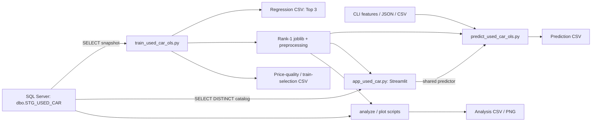

# USECAR_PREDICT_PRICE — Project Context

ตรวจจาก Workspace วันที่ **2026-09-20 (Asia/Bangkok)** โดย V4 เริ่มจาก baseline commit `75f1ea6b2bd3c8ac80de48529c040b101abad144` เอกสารนี้อธิบายพฤติกรรมที่ตรวจพบ ไม่ใช่การอนุมัติเปลี่ยนโมเดลหรือ Schema

## Training Evaluation V4 — implemented, awaiting controlled training

Implementation V4 ถูกเพิ่มบน Git baseline `75f1ea6b2bd3c8ac80de48529c040b101abad144` และผ่าน automated synthetic tests แล้ว แต่ **ยังไม่ได้รัน Training กับ SQL Server** หัวข้อเก่าด้านล่างยังมีประโยชน์ในฐานะ pre-V4/historical artifact context; หากกล่าวถึง BASELINE/EXPERIMENT, all-positive validation หรือ mean-fold ranking ให้ถือว่าถูกแทนด้วย behavior V4 ต่อไปนี้สำหรับ code ปัจจุบัน:

- `clean_target()` ยังตรวจ numeric/finite/positive ก่อน แล้ว `select_eligible_cohort()` กำหนด cohort ถาวร `price > 1,000` สำหรับ Development, CV, Holdout และ Full-data Refit เท่านั้น Predictor/UI ไม่มี target gate
- `build_duplicate_groups()` รวมความสัมพันธ์ `listing_id` หรือ `source_url` แบบ transitiveบน positive-price snapshot ก่อนตัด cohort เพื่อไม่ให้แถวราคา ≤1,000 ที่เชื่อม identity ทำให้ duplicate หลุดข้าม partition; missing identity เป็น singleton `split_development_holdout()` เลือก group-safe split ที่ใกล้ 20% ที่สุดด้วย seed 42 และยอมคลาดเคลื่อนไม่เกิน ±5 percentage points
- `build_common_cv_folds()` สร้าง common 5 folds ครั้งเดียวบน Eligible Development และห้าม group ข้าม fold ทุก candidate รับ fold indices ชุดเดียวกัน
- Numeric-like decision, missing/cardinality eligibility, medians, category levels/reference/OTHER และ backward feature selection เรียนจาก fold train เท่านั้น `evaluate_candidate_cv()` สร้าง OOF predictionครบหนึ่งครั้งต่อ Development row
- `rank_candidates()` ใช้ pooled Development OOF RMSE → pooled OOF MAE → Candidate ID ไม่มี Holdout หรือ adjusted R² ใน ranking
- Top 3 Development checkpoints ถูกเลือกก่อนเปิด Holdout; `evaluate_frozen_candidate()` ประเมิน Holdout เฉพาะ Rank 1 ครั้งเดียว
- `refit_candidate_coefficients()` ใช้ frozen Development preprocessor/selected structure กับ Eligible Full Data แล้ว fit เฉพาะ OLS coefficients ไม่เรียน preprocessorหรือทำ backward eliminationจาก Holdout
- RESULT `RMSE/MAE` คือ Development pooled OOF; fit statistics/coefficients คือ Full-data Refit; `N_OBSERVATION` อ่านจาก `ols_result.nobs` รายโมเดล RESULT 18 และ COEFFICIENT 13 columns คงเดิม
- เพิ่ม evaluation sidecars ใน `output/analysis/<PCS_DATE>/`: aggregate Development OOF metricsของทุก successful candidate, Rank-1 Holdout metrics, row-level Holdout predictions CSV และ metadata JSON ซึ่งแยก Development checkpoint/Holdout/Full-refit semantics ชัดเจน
- Bundle version 2.0 เพิ่ม metadataแบบ additiveและคง required keys/preprocessor contractของ Predictor เดิม Joblib ยังคง Rank 1 Full-data coefficient-only refit
- Source schema เป็น dynamic ทุก run: `SELECT *` ตรวจพบทุกคอลัมน์ แต่ explicit Feature Approval Gate อนุญาตเฉพาะ `APPROVED` ที่ชนิดข้อมูล compatible เข้าสู่ candidate universe; คอลัมน์ใหม่/เปลี่ยนชื่อเป็น `PENDING_REVIEW` และไม่ถูกอนุมัติอัตโนมัติ จากนั้น data-driven eligibility/type inferenceยังเรียนใน fold trainตาม V4
- Registry ที่ `config/feature_approval_registry.json` ยังเป็น initial proposal สถานะ `PENDING_OWNER_APPROVAL` และไม่มี APPROVED predictor จึงบล็อก Full Training จนกว่าเจ้าของตรวจ actual Schema Review และรับรอง registry ดู inventory/ขั้นตอนที่ [FEATURE_APPROVAL_REGISTRY.md](FEATURE_APPROVAL_REGISTRY.md)
- Schema Review Report บันทึก PCS_DATE, New/Missing/Type-changed columns, statuses/reasons, registry version/checksum และ schema fingerprint โดยไม่มีข้อมูลรถรายแถว Evaluation metadataและ bundleบันทึก registry provenanceกับ approved featuresของ run
- Bundleบันทึก `selected_source_features`, frozen preprocessor และ additive `training_feature_schema`; Predictorใช้ schemaตอน trainนี้ จึงไม่รับ featureใหม่เข้ารุ่นเดิมโดยอัตโนมัติและแจ้ง errorเมื่อ featureที่รุ่นเดิมต้องใช้หายไป
- `USED_CAR_RUN_ID` เป็น optional strict `YYYYMMDD_HHMMSS`; collision checkครอบคลุม outputsทุกไฟล์ก่อน writeแรก และ `scripts/run_training_v4.sh` ใช้ `pipefail`/`tee` ให้ logกับ artifactsใช้ ID เดียวกัน
- Current source ไม่มี nonempty password defaultแล้วและต้องตั้ง `USED_CAR_DB_PASSWORD` ผ่าน environment ส่วน credentialที่เคย commit/bytecode/historyยังต้อง rotate/cleanupเป็นงานแยก
- Root `.gitignore` ป้องกัน logs, secrets files, bytecode, `.DS_Store`, generated outputs และ raw listing extractsใหม่ แต่ไม่ untrackหรือลบไฟล์/historyเดิม

Automated tests อยู่ที่ `tests/test_training_evaluation_v4.py` ใช้ synthetic dataเท่านั้น รายละเอียดผลจริงและสิ่งที่ยังไม่ทดสอบอยู่ใน [WORK_LOG.md](WORK_LOG.md)

## 1. ฐานข้อมูลในการตรวจและ Git

- Repository: <https://github.com/krissanapipukmutt/USECAR_PREDICT_PRICE.git>
- ก่อนทำงาน: working tree สะอาด, ไม่มี staged/unstaged diff, branch `master` ติดตาม `origin/master`, ahead/behind `0/0`
- `HEAD`, local `origin/master` และ **live GitHub HEAD/master** ที่ตรวจด้วย `git ls-remote` ตรงกันที่ `3bd4cadb55280535d56999ddeb5503fcd4291084` (`train model`, 2026-09-20 08:59:53 +07:00)
- Remote ที่ตรวจประกาศ branch `master` เท่านั้นและไม่มี tags; ไม่พบความแตกต่างของ tracked Workspace กับ GitHub จึงใช้ Workspace เป็นฐาน โดยไม่ fetch/pull/merge/reset
- อ่าน Python ของ application ครบ 5 ไฟล์: training 1,810 บรรทัด, predictor 266, UI 438, analysis 235, plotting 338 รวม 3,087 บรรทัด ไม่นับ third-party libraries ใน `.venv` และ skill tooling
- อ่าน Data Dictionary เดิมครบสอง worksheet และตรวจ CSV เดิมแบบ headers/keys/aggregates โดยไม่คัดลอกข้อมูลรถรายแถว
- ไม่เชื่อมต่อฐานข้อมูล ไม่รัน training/prediction/UI ไม่ deserialize joblib และไม่เปลี่ยน application, source data หรือ artifacts ผลตรวจ runtime/DB จึงยังไม่ยืนยัน

## 2. Architecture และบทบาทไฟล์

| ไฟล์/ตำแหน่ง | หน้าที่และผลข้างเคียงเมื่อรัน |
| --- | --- |
| `train_used_car_ols.py` | อ่าน SQL Server, เตรียมข้อมูล, เปรียบเทียบ OLS candidates, export CSV และ Rank‑1 joblib พร้อมรายงานคัดแถว |
| `predict_used_car_ols.py` | CLI และ shared prediction functions; ใช้ saved model แบบ offline ได้เมื่อ dependencies/artifact ครบ; CLI เขียน CSV |
| `app_used_car.py` | UI กรอกข้อมูลรถ, เลือก model, อ่าน catalog จาก DB, ทำนายและสร้าง CSV download ใน memory |
| `analyze_used_car_ols.py` | อ่าน snapshot จาก DB และ bundle, สร้างตาราง error/negative/OTHER diagnostics |
| `plot_used_car_ols.py` | อ่าน DB, bundle และ Regression CSV, สร้างกราฟ PNG 5 ประเภท |
| `Docs/Used_Car_OLS_Data_Dictionary_Thai_Clear.xlsx` | Data Dictionary ต้นฉบับของ Regression RESULT/COEFFICIENT ห้ามแก้โดยไม่ได้รับอนุญาต |
| `ONE2CAR/one2car_raw_20260822_144626.csv` | ข้อมูล raw ที่มีอยู่จริง แต่ training ปัจจุบันอ่าน STG จาก DB ไม่ได้อ่าน CSV นี้; ไม่พบ ingestion/ETL script ใน application 5 ไฟล์ |
| `output/train`, `output/predict`, `output/analysis`, `output/graphs` | artifacts เดิม แยกโฟลเดอร์ตาม snapshot `PCS_DATE` รูป `YYYYMMDD` ไม่ใช่วันรัน |

ไม่มี REST service, DWH loader หรือขั้นตอน approve/activate model ที่ implement อยู่ใน scripts ปัจจุบัน

## 3. Database และ Data Dictionary

### การเชื่อมต่อและ read paths

ใช้ SQLAlchemy + `mssql+pyodbc` + `ODBC Driver 18 for SQL Server` ค่าเริ่มต้น database `USED_CAR_DB`, schema `dbo`, source `STG_USED_CAR`; driver/port/schema/table เปลี่ยนผ่าน environment ได้ โค้ดตั้ง `Encrypt=yes;TrustServerCertificate=yes` ข้อมูล server/user/password ไม่บันทึกลงเอกสารนี้

- `build_engine()` / `load_source_data()` (`train_used_car_ols.py:256`, `:274`): quote identifiers และ `SELECT *` ทั้ง source table ไม่มี date WHERE clause
- Training/analysis/plot ต้องมี `price` และ `PCS_DATE` โดย normalize ชื่อสองคอลัมน์นี้แบบไม่สน case และต้องพบ snapshot date ที่ parse ได้เพียงวันเดียวตามค่าเริ่มต้น ไม่ได้เลือก `MAX(PCS_DATE)`
- UI (`app_used_car.py:68`): `SELECT TOP (0) *` ตรวจ schema แล้วอ่าน `SELECT DISTINCT PCS_DATE, brand, model, sub_model` จาก source เดียวกัน ตรวจ single snapshot และ dispose engine
- ไม่พบ INSERT/UPDATE/DELETE/MERGE/DDL หรือ `to_sql` ใน application scripts ทั้งห้า Regression outputs เป็นไฟล์ CSV; ยังไม่ใช่หลักฐานว่าตาราง Regression ถูกสร้างหรือโหลดแล้วใน DB
- ไม่พบ SQL DDL/migration ในโปรเจกต์ และไม่ได้ตรวจ live columns/types/keys/permissions/row count
- `parse_single_pcs_date()` นับเฉพาะวันที่ parse สำเร็จ จึงอาจรับข้อมูลที่ปน missing/invalid PCS_DATE หากยังมี valid date เพียงวันเดียว; ยังไม่ได้ทดสอบกรณีนี้กับ DB จริง

### Contract ที่ตรวจได้

Workbook มี sheet `OLS_REGRESSION_RESULT` และ `OLS_REGRESSION_COEFFICIENT` บรรทัด A2 ของทั้งคู่ระบุชัดว่า datatype, keys และ rules เป็น **proposed design; verify against SQL DDL before deployment** ตัวอย่างอ้าง run `20260919_145500` และหลายช่องระบุ owner ว่า R ขณะที่ implementation ปัจจุบันเป็น Python/statsmodels

ชื่อและลำดับคอลัมน์ตรงกับ constants ใน `train_used_car_ols.py:177` / `:198` และ CSV ทั้ง 5 runs ที่มีอยู่:

- RESULT (18): `MODEL_ID`, `MODEL_NAME`, `TARGET_NAME`, `TRAIN_PCS_DATE`, `TRAIN_DATE`, `N_OBSERVATION`, `R_SQUARED`, `ADJ_R_SQUARED`, `MAE`, `RMSE`, `F_STATISTIC`, `F_P_VALUE`, `P_VALUE_THRESHOLD`, `CONFIDENCE_LEVEL`, `ACTIVE_FLAG`, `APPROVED_BY`, `APPROVED_DATE`, `PCS_DATE`
- COEFFICIENT (13): `MODEL_ID`, `FEATURE_SEQ`, `SOURCE_COLUMN`, `ORIGINAL_VALUE`, `FEATURE_NAME`, `FEATURE_TYPE`, `COEFFICIENT`, `P_VALUE`, `SOURCE_FEATURE_P_VALUE`, `CI_LOWER`, `CI_UPPER`, `IS_REFERENCE`, `PCS_DATE`

ตาม Dictionary: RESULT ใช้ `MODEL_ID VARCHAR(15)` เป็น PK; COEFFICIENT ใช้ `(MODEL_ID, FEATURE_SEQ)` เป็น PK และ MODEL_ID เป็น FK ไป RESULT นี่คือ contract จากเอกสาร ไม่ใช่ DDL ที่ยืนยันแล้ว การตรวจ CSV พบ ID ไม่ซ้ำ, composite key ไม่ซ้ำ และไม่มี coefficient ที่อ้าง ID นอก RESULT ในแต่ละ run

ความหมายสำคัญใน implementation:

- `MODEL_ID` = run datetime + `(rank - 1)` วินาที รูป `YYYYMMDD_HHMMSS`; มีความยาว 15 แต่ไม่มี global/concurrent-run uniqueness guard
- `N_OBSERVATION` = จำนวนแถว final-fit หลัง Price Filter; `TRAIN_PCS_DATE` และ `PCS_DATE` ตั้งจาก source snapshot เหมือนกัน ส่วน `TRAIN_DATE` คือเวลาเริ่ม run
- `RMSE`/`MAE` มาจาก CV; `R_SQUARED`/`ADJ_R_SQUARED`/F statistics และ coefficient statistics มาจาก final fit จึงไม่ควรอ่านทั้งหมดเป็น validation metrics
- `P_VALUE` เป็นราย coefficient; `SOURCE_FEATURE_P_VALUE` เป็น joint F-test ของทั้ง source feature; coefficient CI ใช้ `CONFIDENCE_LEVEL=0.95`
- Reference ONEHOT row มี `IS_REFERENCE=Y`, coefficient/P_VALUE/CI/FEATURE_NAME เป็น NULL; intercept และ numeric มี `IS_REFERENCE=N`
- Export ตั้ง `ACTIVE_FLAG`, `APPROVED_BY`, `APPROVED_DATE` เป็น NULL; CLI/UI เลือกไฟล์ model โดยไม่ได้อ่านสถานะอนุมัติใน Regression table
- Dictionary อธิบาย `PCS_DATE` เป็นรอบประมวลผล DWH แต่ Python ใส่ source snapshot date; ต้องตกลงความหมายกับ DWH ก่อนทำ loader โดยยังไม่แก้ Dictionary หรือ output schema

## 4. Training ปัจจุบัน

อ้างอิง `train_used_car_ols.py:1528` และ helper functions ที่เรียกตามลำดับ:

1. ตรวจ config, สร้าง `run_id`, อ่าน STG และตรวจ snapshot
2. สร้าง Outlier reports จาก source ก่อน clean target เป็นรายงานเพื่อ review เท่านั้น
3. `clean_target()` เก็บราคา numeric, finite และ `>0`; ต้องเหลืออย่างน้อย 30 แถว แถวไม่ผ่านถูกตัดเฉพาะ DataFrame ใน process ไม่ได้แก้ source
4. `maybe_convert_numeric_like_columns()` แปลงคอลัมน์ข้อความที่เข้าเกณฑ์ numeric conversion ≥98%
5. สร้าง final training selection และ audit report แล้ว infer feature eligibility จาก final training cohort; CV ยังคง split จาก full cleaned positive-price cohort
6. สร้าง candidates, fit preprocessing/คัด feature ภายใน CV train แต่ละ fold, ประเมิน validation, final refit, deduplicate/rank และ export

### Features / Encoding / OLS

- Dynamic schema ตัด target, PCS_DATE, listing identifiers ที่ระบุไว้, raw fields, URL/image/description/time fields ตาม exclusion config; ตัด datetime, missing ratio >95%, constant/empty
- Numeric ที่เหลือเข้า candidate ได้; categorical ทั่วไปต้อง distinct ≤60 และ unique ratio ≤0.5 ส่วน `brand`, `model`, `sub_model` ยกเว้นข้อจำกัด cardinality ช่วง eligibility แต่ยังถูกจำกัดระดับเมื่อ encoding
- Candidate generation เปรียบเทียบ brand+model, เพิ่ม optional sub_model, brand-only/model-only และสุ่ม supplementary features ด้วย seed 42 ที่สัดส่วน 0.85/0.65/0.45; baseline สูงสุด 8 ชุด และเพิ่ม expanded encoding ของสองชุดแรก รวมสูงสุด 10 experiments (`:979`, `:1023`)
- Numeric ใช้ training median; categorical strip whitespace, missing เป็น `__MISSING__`; รักษา case ของ category values, รวมหมวดหายากเป็น `__OTHER__`, เลือก reference จากหมวดที่พบบ่อยที่สุดและ tie-break แบบ deterministic
- Encoding `BASELINE`: max levels brand/model/sub_model = 25/35/15, min counts = 20/30/40; `EXPANDED_BRAND_MODEL`: max = 80/110/15, min = 5/10/40; อื่น ๆ max 60/min 20 สงวนหนึ่งช่องไว้สำหรับ OTHER แต่ OTHER จะอยู่ใน saved levels ต่อเมื่อเกิดจากข้อมูลจริง
- สถิติ category/median เรียนจาก train fold เท่านั้น; future inputs ใช้ saved values, unseen category → OTHER ถ้ามี มิฉะนั้น reference
- Fit `statsmodels.OLS(price, constant + numeric + one-hot).fit()` บนราคาหน่วยบาทโดยตรง ไม่มี log-target, interaction หรือ price clamp; การใช้ log ใน Outlier Detection ไม่ใช่ target transform
- Backward elimination ทดสอบ source feature ทั้งกลุ่มด้วย F-test ตัดกลุ่ม P-value สูงสุดจนทุกกลุ่ม ≤0.05 หรือเหลือขั้นต่ำ 1 กลุ่ม ดังนั้นกลุ่มสุดท้ายอาจยังมี P-value >0.05; ไม่ได้ตัด dummy แยกตัวตาม P-value

### CV / การเลือกโมเดล

- `KFold(n_splits=5, shuffle=True, random_state=42)` ไม่มี separate holdout (`:1037`)
- ในแต่ละ fold ใช้ Price Filter เฉพาะ train partition; validation เก็บทุกแถวจาก full cleaned cohort รวมราคาบวกที่ ≤1,000
- RMSE/MAE หลักเป็นค่าเฉลี่ย metric ของ 5 folds; ranking เรียง CV RMSE ต่ำ → CV MAE ต่ำ → final adjusted R² สูง; deduplicate ตาม selected source features และ retained category levels
- รายงานเพิ่ม: eligible cohort ราคา >1,000 และไม่ใช่ confirmed bad ID, ราคา ≥3,000,000, negative prediction rate, model OTHER rate; eligible RMSE/MAE รวม error แบบ pooled OOF และ **ไม่ใช้จัดอันดับ**
- Final fit เรียน preprocessing และคัด feature ใหม่บน final training cohort ทั้งหมด Top 3 ถูก export เป็นสอง Regression CSV; joblib เก็บเฉพาะ Rank 1
- CV ไม่ใช่ untouched test set: ใช้เลือก candidate ด้วย และ numeric-type inference/feature eligibility ถูกกำหนดก่อน CV; ยังไม่ได้ประเมินผลของขั้นตอนเหล่านี้ต่อ generalization

## 5. Price Filter และ Outlier Detection เป็นคนละขั้นตอน

### Price Filter (`:530`, `:565`, `:577`)

| โหมด | CV train และ final fit | CV validation |
| --- | --- | --- |
| `BASELINE` (code default) | เก็บทุกแถวที่ผ่าน clean target; ไม่ใช้ experimental exclusion | ทุกแถว positive-price ที่ clean แล้ว |
| `EXPERIMENT` ผ่าน `USED_CAR_PRICE_FILTER_MODE` | ตัดราคา ≤1,000 บาท หรือ listing ID ที่ยืนยันว่าผิดใน `CONFIRMED_BAD_LISTING_IDS` | ใช้ชุดเต็มเหมือนเดิม ไม่มีการตัดราคา ≤1,000 |

`CONFIRMED_BAD_LISTING_IDS` ในโค้ดปัจจุบันเป็น list ว่าง การมี SUSPECTED_OUTLIER ไม่ใช่เหตุให้ตัด train อัตโนมัติ ทั้งสองโหมดเขียน `train_row_selection_<RUN_ID>.csv` พร้อม mode/reason/Y-N เพื่อ audit final fit; ไม่ใช่รายงานการเลือกแถวของทุก CV fold

ข้อควรตรวจเมื่อจะใช้ confirmed IDs: numeric-like conversion ทำก่อน matching และครอบคลุม `listing_id` ด้วย หาก ID เป็นตัวเลขที่มี leading zeros อาจเสียรูปก่อนเทียบ string กับรายการที่ยืนยันไว้ ยังไม่พบผลกระทบจาก list ว่างใน config ปัจจุบัน

### Outlier Detection (`:339`)

- Flag-only เสมอ ไม่แก้ STG และไม่เปลี่ยน training selection
- Missing/nonpositive price → `INVALID_OR_NONPOSITIVE_PRICE`; ราคาบวก ≤1,000 → `VERY_LOW_PRICE_REVIEW`
- ราคา >1,000 เทียบ peer ตามลำดับละเอียดไปกว้าง: brand+model+sub_model+model_year → brand+model+model_year → brand+model
- ต้องมี peer อย่างน้อย 15 แถว; กลุ่ม brand+model แบบกว้างต้องมีช่วง model_year ≤3 ปี; normalize peer labels แบบ casefold; ใช้กลุ่มแรกที่เข้าเงื่อนไข หากไม่มีเป็น `INSUFFICIENT_GROUP_DATA`
- บน log(price): `z = 0.6745 × (log(price) − median(log(price))) / max(MAD(log(price)), 0.10)` และ `ratio = price / exp(median(log(price)))`
- Flag สูงเมื่อ `z > 3.5` **และ** `ratio ≥3`; flag ต่ำเมื่อ `z <−3.5` **และ** `ratio ≤1/3`; อื่น ๆ เป็น NORMAL
- Export `price_quality_all_<RUN_ID>.csv` และ `price_outliers_for_review_<RUN_ID>.csv` ใน `output/analysis/<PCS_DATE>/` ซึ่งมีข้อมูลระดับ listing จึงต้องควบคุมการเผยแพร่
- Report แปลง infinity เป็น missing ก่อน flag invalid และ strip commas จากราคา แต่ `clean_target()` ไม่ strip commas; numeric strings จึงอาจได้รับการจัดกลุ่มใน report ต่างจากการใช้ train ต้องตรวจ edge cases ก่อนเทียบยอดระหว่างขั้นตอน

## 6. Model artifacts ที่มีอยู่จริง

พบ 5 complete runs ใน `output/train/20260918/` แต่ละ run มี RESULT (3 models), COEFFICIENT และ joblib; ชื่อเรียงเวลาเป็นดังนี้:

| RUN_ID | COEFFICIENT rows | joblib bytes | Price mode ที่ยืนยันจาก selection CSV |
| --- | ---: | ---: | --- |
| `20260919_230223` | 317 | 30,547,667 | ไม่พบ selection report สำหรับ run นี้ |
| `20260920_011528` | 522 | 58,405,116 | ไม่พบ selection report สำหรับ run นี้ |
| `20260920_083158` | 522 | 58,405,116 | ไม่พบ selection report สำหรับ run นี้ |
| `20260920_085346` | 522 | 58,405,044 | BASELINE |
| `20260920_085412` | 317 | 30,193,279 | EXPERIMENT |

รวม joblib **235,956,222 bytes** ทั้งห้าถูก Git ติดตามอยู่แล้ว Run ล่าสุดตามชื่อคือ `20260920_085412` ไม่ได้แปลว่าถูกอนุมัติใช้งานหรือดีที่สุด; code default ของ training ยังเป็น BASELINE

ตัวอย่างผลที่อ่านจาก RESULT และ selection CSV เดิม (ไม่ใช่ผลรันใหม่):

| Rank‑1 run | Final-fit rows | Excluded rows | CV RMSE (บาท) | CV MAE (บาท) | Final adjusted R² |
| --- | ---: | ---: | ---: | ---: | ---: |
| `20260920_085346` BASELINE | 34,848 | 0 | 1,020,440.92 | 314,887.12 | 0.498325 |
| `20260920_085412` EXPERIMENT | 34,250 | 598 | 1,110,814.34 | 456,889.75 | 0.515065 |

CSV สะท้อนว่า latest experiment มี full-validation errors สูงกว่า baseline ตัวอย่างนี้ แม้ final adjusted R² สูงขึ้น แต่ยังไม่ใช้ยืนยันเหตุเชิงสาเหตุหรือเลือก production model: final-fit cohort/selected model อาจต่างกัน, ไม่มี source hash/log ครบสำหรับทำซ้ำ และ eligible-cohort metrics ไม่อยู่ใน Regression CSV

Selected source features ของ Rank 1 ล่าสุดตาม COEFFICIENT CSV คือ `body_type`, `brand`, `color`, `engine_size`, `fuel_type`, `mileage`, `model`, `model_year`, `number_of_seats`, `sub_model` มี 111 coefficient/reference rows รวม reference 6 แถว; เป็นการอ่าน CSV ไม่ได้ยืนยันความตรงกันกับ joblib ภายใน

Outlier reports 3 runs (`083158`, `085346`, `085412`) มี counts ตรงกัน: NORMAL 25,844; INSUFFICIENT_GROUP_DATA 8,400; SUSPECTED_OUTLIER 604 = very-low-price 598 + low-vs-peers 2 + high-vs-peers 4 ส่วน 6 peer outliers ไม่ได้ถูกตัดเพียงเพราะ flag

Bundle contract จาก `build_top1_model_bundle()` (`:1480`): `artifact_version=1.0`, OLS result, run/model/rank/date, target, selected source/encoded features, medians, categories/reference/feature groups, encoding profile/config, p-value/confidence settings, price-filter settings/confirmed IDs และ CV/final-fit metrics ไม่ได้เปิด joblib เพื่อยืนยัน internal metadata ของไฟล์เก่าทุก run

Joblib serializes statsmodels result ซึ่งอาจเก็บ training arrays ด้วย จึงต้องถือเป็น artifact ที่อาจมีข้อมูลฝึก ไม่ใช่เพียง coefficients; consumers ใช้ preprocessing helpers ร่วมกับ training module และการโหลดต้องใช้ไฟล์ที่เชื่อถือได้กับ dependencies ที่เข้ากันได้ ปัจจุบันไม่มี source commit/dependency manifest/hash ใน bundle contract และไม่ได้ตรวจ model loading ในงานนี้

## 7. Prediction และ UI

### CLI / shared predictor (`predict_used_car_ols.py`)

- ใช้ `USED_CAR_PROJECT_DIR`, `USED_CAR_ARTIFACT_DIR`, `USED_CAR_PREDICT_DIR`; defaults ผูกกับ path เครื่องปัจจุบัน เมื่อไม่ระบุ run เลือก bundle จากชื่อ run ที่เรียงสูงสุด ไม่ใช้ filesystem mtime หรือ ACTIVE_FLAG
- ตรวจ required bundle keys, Rank 1, filename/run และ snapshot/folder; `make_state()` จำกัด preprocessing ให้เหลือเฉพาะ selected source features จึงไม่บังคับกรอก feature ที่ถูกคัดออก
- Input รองรับ direct feature arguments, single-object JSON, CSV batch, feature list และ template; ชื่อคอลัมน์ไม่สน case ต้องมี selected features ครบและไม่มีชื่อซ้ำเมื่อ casefold
- Numeric ที่แปลงไม่ได้/ไม่ finite → saved median; category ที่ไม่รู้จัก → OTHER หรือ reference; เรียง encoded columns ให้ตรง model parameters ก่อน `fit.predict()`
- เป็น OLS point prediction ไม่มี prediction interval และไม่ clamp ค่าติดลบ ตรวจ shape/finite ของผล แล้วเพิ่ม negative flag
- Output: `MODEL_ID`, `TRAIN_PCS_DATE`, input columns, `PREDICTED_PRICE_THB`, `NEGATIVE_PREDICTION`, และ `<feature>_MODEL_CATEGORY` ของ selected categorical features; JSON/CSV extra columns ถูกส่งต่อด้วย
- Default prediction CSV คือ `output/predict/<PCS_DATE>/used_car_predictions_<RUN_ID>.csv` (UTF‑8 BOM, float 2 decimals); run เดิมใช้ชื่อเดิมจึงเขียนทับได้ ควรกำหนด output path แยกเมื่อได้รับมอบหมายให้ทดสอบ

### Streamlit (`app_used_car.py`)

- เลือก model ตาม valid filenames/date folders; default เป็น run ล่าสุด แสดง model/source date และเตือนเมื่อ snapshot ต่างกัน
- Brand → Model → Sub-model options จาก STG จริง เลือกหรือพิมพ์ค่าใหม่ได้; dependent widget keys ผูก model/parent selection เพื่อ reset ค่าลูกเมื่อ parent เปลี่ยน
- สร้าง input จาก selected model features; numeric เริ่มว่างและใช้ median เป็น hint, ต้องเป็น finite number, mileage/engine_size ≥0, seats เป็น integer >0, model_year integer 1886–2100
- Brand/model ต้องกรอก; missing categorical อื่นต้องเลือก “ไม่มีข้อมูล / ไม่ทราบ” อย่างชัดเจน
- Model ใช้ `st.cache_resource` key path/mtime/size; catalog ใช้ `st.cache_data` ไม่มี TTL ต้องกด refresh หรือเริ่ม process ใหม่เมื่อข้อมูลเปลี่ยน
- ปุ่ม predict เรียก shared predictor แสดงราคา/negative warning/category mapping; CSV download สร้างใน memory ไม่เขียน `output/predict` และไม่แก้ DB
- ผลทำนายไม่ได้เก็บใน session state อย่างชัดเจน จึงอยู่เฉพาะ rerun ที่กด predict; cascade เปรียบเทียบ case-insensitive แต่ model category values เป็น case-sensitive

## 8. Diagnostics และสภาพแวดล้อม

- `analyze_used_car_ols.py:27` default run ถูก pin ที่ `20260920_011528`; มี overview, errors by price band, top 100 errors, negatives, OTHER comparison, OTHER by feature และ all predictions
- `plot_used_car_ols.py:35` / `:50` เลือก latest complete run เมื่อไม่ override; สร้าง actual-vs-predicted, residual, model comparison, price distribution และ coefficient CI plots
- ทั้งสองอ่าน source DB ใหม่ ตรวจ snapshot ให้ตรง bundle แต่ไม่ได้ใช้ saved final-fit selection เพื่อจำกัด diagnostics สำหรับ EXPERIMENT จึงอาจนำ 598 แถวที่ไม่ใช้ final fit มาปนในรายงานที่เรียกว่า in-sample
- Plot ไม่เรียก numeric-like conversion แบบ train/analyze จึงอาจมี preprocessing ต่างกันเมื่อ source เป็น numeric strings; OTHER diagnostics ของ analyze อิง initial categorical state ซึ่งอาจรวม feature ที่ model ตัดออก
- Latest overview ที่มีจริงคือ run `20260920_011528`: 34,848 rows, in-sample MAE 309,111.96 บาท, RMSE 990,734.71 บาท, negative 1,532 (4.396235%), ANY_OTHER 25,019 (71.794651%) เป็นผลเก่าและไม่ใช่ CV/latest experiment
- พบ `.venv/pyvenv.cfg` ระบุ Python 3.14.4; อ่าน installed package metadata พบ pandas 3.0.6, numpy 2.5.3, statsmodels 0.15.0, scikit-learn 1.9.1, scipy 1.18.1, SQLAlchemy 2.0.54, pyodbc 5.3.0, joblib 1.6.0, Streamlit 1.64.0, matplotlib 3.11.2, patsy 1.0.3 นี่ไม่ใช่ผลยืนยัน import/runtime compatibility
- ไม่พบ requirements/pyproject/lockfile, tests หรือ SQL migration ของ application; ไม่ได้ติดตั้งหรือเปลี่ยน dependencies และไม่ได้ตรวจ ODBC installation/network access

## 9. Secrets และ Git hygiene ที่ตรวจพบ

1. **พบ credential ใน Git history เดิม**: V4 เอา nonempty default ออกจาก source ปัจจุบันแล้ว แต่ค่าที่เคยอยู่ใน commits/ tracked bytecode ยังไม่ถูกลบจาก history และยังต้อง rotate
2. พบ default นี้ในทั้งสาม reachable commits `09fa6ce`, `b03cf40`, `3bd4cad`; commit `b03cf40` มีใน historical `train_used_car_ols_backup.py` ด้วย Live remote master ตรง HEAD จึงมี affected current files ใน remote commit ที่ตรวจได้ ยังไม่ตรวจ validity ของ credential หรือ repository visibility
3. V4 เพิ่ม root `.gitignore` สำหรับ `.env*`, Streamlit secrets, logs, bytecode, `.DS_Store`, generated output และ raw extractsใหม่; `.gitattributes` ยังไม่มี
4. Ignore rules ไม่มีผลย้อนหลังกับไฟล์ที่ track หรือ secretใน history การ untrack/rotation/history cleanup ยังไม่ได้ทำ
5. ไม่พบ `.env`, `.env.example`, `.streamlit/secrets.toml`; relevant DB environment keys ไม่ได้ตั้งใน audit process แต่ยังไม่ทราบค่าใน terminal/UI process อื่น
6. ก่อนทำเอกสารมี tracked entries 66 รายการ รวม 35 CSV, 5 joblib, 2 pyc, 10 PNG, 5 Python และ Data Dictionary 1 ไฟล์; raw CSV ขนาด 28,237,950 bytes มี 34,848 rows และคอลัมน์ seller/location/description/URLs รายงาน analysis/prediction/selection มี listing-level data ด้วย

ตรวจ secrets แบบ targeted static/AST/history และ byte comparison ไม่ใช่ forensic scan ทุก binary blob ห้ามนำค่าลับหรือข้อมูลรถรายแถวมาใส่เอกสาร/คำตอบ การเพิ่ม ignore ภายหลังไม่ลบสิ่งที่อยู่ใน Git history แล้ว

## 10. ปัญหาคงค้างและงานถัดไปที่เสนอ

| ลำดับ | งานที่เสนอ | เหตุผล / ขอบเขตที่ต้องตกลงก่อนลงมือ |
| --- | --- | --- |
| 1 | Rotate credential ที่พบ, เอา hardcoded fallback/bytecode exposure ออก และจัด secret configuration | พบใน remote commit/history แล้ว; งานนี้ยังไม่เปลี่ยน credential หรือ application |
| 2 | เพิ่ม explicit `.gitignore`, ทบทวน tracked raw/row-level outputs/joblib และนโยบายเก็บ artifacts | ต้องแยกการเพิ่ม ignore, untrack, ลบไฟล์ และ history rewrite; ไม่ทำโดยอัตโนมัติ |
| 3 | ยืนยัน live DDL และความหมาย PCS_DATE/approval workflow กับ Data Dictionary | ชื่อ/ลำดับตรงแล้ว แต่ types/keys/DWH semantics ยังไม่ยืนยัน; ห้ามเปลี่ยน DB/output schema เอง |
| 4 | สร้าง dependency manifest และตรวจ trusted bundle load/CLI/UI ในสภาพแวดล้อมควบคุม | ปัจจุบันเครื่อง/path/package versions ผูกกับ local environment และยังไม่มี runtime test |
| 5 | ทบทวน baseline/experiment ด้วย source snapshot ที่ตรวจสอบย้อนกลับได้และ shared eligible metrics | Latest experiment full-validation errors สูงกว่า baseline ที่ยกมา; CV ถูกใช้เลือกโมเดล ยังไม่มี independent holdout |
| 6 | ทำ diagnostics ให้เลือก run/cohort ตรง training และระบุ in-sample/OOF ชัดเจน | Analyze pin run เก่า; experiment exclusions และ numeric conversion ยังไม่สอดคล้องครบ |
| 7 | ทดสอบ input contract / fallback และ UI freshness | CLI comma-form numeric อาจกลายเป็น median แต่ UI strip commas; category case mismatch; catalog ไม่มี TTL; CSV input reserved columns อาจชน MODEL_ID/TRAIN_PCS_DATE |
| 8 | ทบทวน model ID uniqueness, artifact provenance และการเลือก approved model | Timestamp วินาทีไม่รับประกันข้าม concurrent runs, bundle ไม่มี source/dependency hash, newest file ไม่เท่ากับ approved model |

งานเหล่านี้เป็นข้อเสนอจากการตรวจ ยังไม่ใช่การอนุมัติเปลี่ยน OLS/Price Filter/Outlier/Prediction/Schema และไม่รวมการ Commit หรือ Push ดูผลตรวจและรายการสิ่งที่ยังไม่ทดสอบใน [WORK_LOG.md](WORK_LOG.md)
