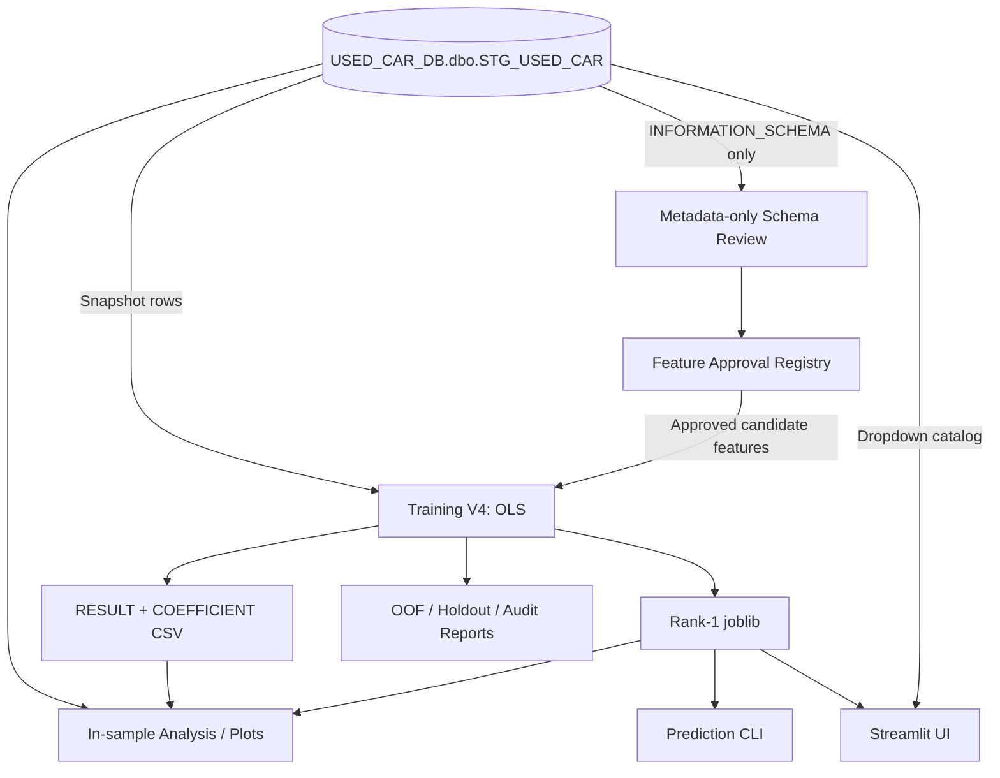

# USECAR_PREDICT_PRICE

คู่มือหลักภาษาไทยสำหรับระบบ OLS Used Car Price Prediction ตั้งแต่ตรวจ Schema, ควบคุม Feature, Train, อ่านผล ไปจนถึง Predict ผ่าน CLI และ Streamlit

> สถานะปัจจุบัน: Feature Registry ได้รับ Owner Approval สำหรับให้ 11 predictors เข้าสู่ Candidate Universe แล้ว แต่การอนุมัตินี้ไม่ได้บังคับให้โมเดลเลือกครบทุก feature และไม่ได้แทนการอนุมัติ Controlled Training แต่ละครั้ง

## สารบัญ

- [1. Project Overview](#project-overview)
- [2. คำสั่งทั้งหมดที่ใช้บ่อย — Copy & Run](#quick-start)
- [3. Project Structure](#project-structure)
- [4. คู่มือ Python ทุกไฟล์](#python-files)
- [5. Shell Scripts และ Runners](#shell-scripts)
- [6. Feature Approval และ Dynamic Schema](#feature-approval)
- [7. Training V4 Explained](#training-v4)
- [8. Training Output และ Artifact Dictionary](#artifacts)
- [9. Prediction Guide](#prediction-guide)
- [10. Model Evaluation และข้อจำกัด](#evaluation-limitations)
- [11. Operation Runbook](#operation-runbook)
- [12. Troubleshooting / FAQ](#troubleshooting)
- [13. Documentation Index และการดูแลเอกสาร](#documentation-index)

<a id="project-overview"></a>
## 1. Project Overview

โปรเจกต์นี้สร้างโมเดล **Ordinary Least Squares (OLS)** เพื่อประมาณ `price` ของประกาศรถมือสองจาก latest snapshot ใน `USED_CAR_DB.dbo.STG_USED_CAR` ค่าเป้าหมายคือราคาที่อยู่ใน source snapshot ไม่ใช่ราคาขายจริงในอนาคตที่ระบบรับประกัน

Training V4 ใช้เฉพาะแถวที่ `price > 1,000` บาทในการ Train/Evaluation เพราะเป็นกลุ่มที่กำหนดว่ามีราคาสำหรับเรียนรู้ เงื่อนไขนี้ใช้กับข้อมูลที่ทราบ target เท่านั้น ไม่ใช้ตรวจรถใหม่ก่อน Predict

เทคโนโลยีที่พบจาก source จริง:

- Python, pandas, NumPy
- statsmodels OLS
- scikit-learn สำหรับ metrics และ stratified/group-aware folds
- SQLAlchemy + pyodbc สำหรับ SQL Server
- joblib สำหรับ Model Bundle
- Streamlit สำหรับ UI
- matplotlib สำหรับกราฟ diagnostics
- Bash สำหรับ schema-review และ training runners

โปรเจกต์ยังไม่มี `requirements.txt`, `pyproject.toml` หรือ dependency lockfile จึงยังไม่มีคำสั่งสร้าง environment ใหม่ที่รับประกัน reproducibility



Training Workflow อ่าน DB, ตรวจ Registry/Schema, สร้าง Development/Holdout และ CV, fit OLS แล้วเขียน artifacts ส่วน Prediction Workflow โหลด Rank-1 `.joblib` ที่มี frozen feature schema/preprocessor และไม่ retrain

<a id="quick-start"></a>
## 2. คำสั่งทั้งหมดที่ใช้บ่อย — Copy & Run

คำสั่งทุก block ด้านล่างเริ่มจาก Project Root และใช้ `.venv/bin/python` โดยตรง จึงไม่ต้อง activate virtual environment ก่อน คำสั่งที่แตะ SQL Server อ่านข้อมูลเท่านั้นตาม implementation ปัจจุบัน แต่ Training, Analyze และ Plot อ่านข้อมูลรถจริงจาก STG; Schema Review อ่านเฉพาะ metadata

### 2.1 ตั้งค่า Project / ตรวจ Python

**When to run:** ทุกครั้งที่เปิด Terminal ใหม่เพื่อยืนยัน path และ Python
**Requires SQL Server:** No

```bash
cd /Users/krissanap/Document/KMUTT/USECAR_PREDICT_PRICE
.venv/bin/python --version
```

**Expected output:** แสดง Python version โดยไม่สร้างไฟล์
**ข้อควรระวัง:** โปรเจกต์ยังไม่มี dependency manifest/lockfile จึงไม่ควรเดาคำสั่งติดตั้ง package ใหม่จาก README

### 2.2 ตั้งค่า SQL Server Password บน macOS zsh

ใช้ block นี้ก่อนคำสั่ง Training, Analyze, Plot หรือ Streamlit ที่ต้องสร้าง dropdown catalog ตัว Password จะไม่ปรากฏบนหน้าจอและไม่ถูกใส่ใน shell history

```bash
cd /Users/krissanap/Document/KMUTT/USECAR_PREDICT_PRICE
read -rs "USED_CAR_DB_PASSWORD?SQL Server password: "
echo
export USED_CAR_DB_PASSWORD
```

เมื่อทำงานเสร็จให้ล้างค่าจาก Terminal session:

```bash
unset USED_CAR_DB_PASSWORD
```

ค่าการเชื่อมต่อที่ source รองรับ:

ค่าที่เกี่ยวข้องกับฐานข้อมูล:

| Variable | ค่า default ในโค้ด / หน้าที่ |
| --- | --- |
| `USED_CAR_DB_SERVER` | `127.0.0.1` |
| `USED_CAR_DB_PORT` | `1433` |
| `USED_CAR_DB_DATABASE` | `USED_CAR_DB` |
| `USED_CAR_DB_USER` | `sa` |
| `USED_CAR_DB_PASSWORD` | ไม่มี default ที่ใช้งานได้ ต้องกำหนด |
| `USED_CAR_DB_DRIVER` | `ODBC Driver 18 for SQL Server` |
| `USED_CAR_DB_SCHEMA` | `dbo` |
| `USED_CAR_SOURCE_TABLE` | `STG_USED_CAR` |

### 2.3 ตรวจ Actual Schema

**When to run:** ก่อนพิจารณา Feature Registry หรือก่อน Training เมื่อ source schema อาจเปลี่ยน
**Requires SQL Server:** Yes — metadata only; runner จะถาม Password แบบไม่แสดงบนหน้าจอถ้ายังไม่ได้ export

```bash
cd /Users/krissanap/Document/KMUTT/USECAR_PREDICT_PRICE
./scripts/run_schema_review.sh --output "output/analysis/schema_review/actual_schema_manual_$(date '+%Y%m%d_%H%M%S').json"
```

**Expected output:** JSON metadata ใหม่ใน `output/analysis/schema_review/`
**ข้อควรระวัง:** อ่านเพียง `INFORMATION_SCHEMA.COLUMNS`; output path เดิมจะไม่ถูกเขียนทับ

### 2.4 Validate Registry แบบ Offline

**When to run:** หลังมี Schema Report และก่อน Training
**Requires SQL Server:** No

```bash
cd /Users/krissanap/Document/KMUTT/USECAR_PREDICT_PRICE
PYTHONDONTWRITEBYTECODE=1 .venv/bin/python scripts/validate_schema_registry.py \
  output/analysis/schema_review/actual_schema_20260920_130140.json
```

**Expected output:** JSON comparison บน Terminal; exit code `0` เมื่อ valid และ `1` เมื่อมี issue
**ข้อควรระวัง:** คำสั่งนี้ไม่เปลี่ยนสถานะ approval

### 2.5 Train Model

**When to run:** เมื่อ Registry/Schema ผ่านและเจ้าของ Project อนุมัติ Training แล้ว
**Requires SQL Server:** Yes — อ่าน snapshot จริงและเริ่ม Full Training จริง

```bash
cd /Users/krissanap/Document/KMUTT/USECAR_PREDICT_PRICE
read -rs "USED_CAR_DB_PASSWORD?SQL Server password: "
echo
export USED_CAR_DB_PASSWORD
./scripts/run_training_v4.sh
unset USED_CAR_DB_PASSWORD
```

**Expected output:** `output/train/YYYYMMDD/`, `output/analysis/YYYYMMDD/` และ `logs/train_YYYYMMDD_HHMMSS.log` โดยใช้ RUN_ID เดียวกัน
**ข้อควรระวัง:** ไม่ใช่ dry run; runner ปฏิเสธ log/artifact collision และตรวจ artifact หลักสามไฟล์

### 2.6 ดูรายชื่อ Features ของ Model

**When to run:** ก่อนเตรียม input เพื่อดู frozen input contract ของ Run
**Requires SQL Server:** No

```bash
cd /Users/krissanap/Document/KMUTT/USECAR_PREDICT_PRICE
.venv/bin/python predict_used_car_ols.py \
  --run-id 20260920_222201 \
  --show-features
```

**Expected output:** numeric medians, categorical levels และ reference categories บน Terminal
**ข้อควรระวัง:** โหลดเฉพาะ `.joblib` ที่เชื่อถือได้

### 2.7 Predict รถ 1 คัน

**When to run:** เมื่อต้องการ point prediction จาก saved model
**Requires SQL Server:** No

```bash
cd /Users/krissanap/Document/KMUTT/USECAR_PREDICT_PRICE
.venv/bin/python predict_used_car_ols.py \
  --run-id 20260920_222201 \
  --brand Toyota \
  --model CAMRY \
  --sub_model "2.5 HEV Premium" \
  --model_year 2022 \
  --mileage 45000 \
  --fuel_type Hybrid \
  --transmission Automatic \
  --engine_size 2.5 \
  --body_type Sedan \
  --color Black \
  --number_of_seats 5 \
  --output-csv output/predict/20260918/toyota_camry_cli_20260920_222201.csv
```

**Expected output:** CSV ชื่อใหม่ตาม path ที่ระบุและสรุปราคาบน Terminal
**ข้อควรระวัง:** category case-sensitive; `CAMRY` ต่างจาก `Camry` และ `2.5 HEV Premium` อาจ map เป็น `__OTHER__`; ผลไม่ใช่ราคาตลาดที่รับประกัน

### 2.8 สร้าง CSV Template

**When to run:** ก่อนจัดทำ batch input ตามลำดับ feature ของ model
**Requires SQL Server:** No

```bash
cd /Users/krissanap/Document/KMUTT/USECAR_PREDICT_PRICE
.venv/bin/python predict_used_car_ols.py \
  --run-id 20260920_222201 \
  --write-template \
  --output-csv output/predict/20260918/camry_batch_template_20260920_222201.csv
```

**Expected output:** CSV header ครบ 11 inputs ที่ path ระบุ
**ข้อควรระวัง:** กรอกทุก required column แล้วบันทึกเป็นไฟล์ input ใหม่ก่อน predict

### 2.9 Predict หลายคันจาก CSV

**When to run:** เมื่อมีรถหลายแถว; block นี้สร้าง synthetic input สองแถวก่อนแล้วจึง predict
**Requires SQL Server:** No

```bash
cd /Users/krissanap/Document/KMUTT/USECAR_PREDICT_PRICE
mkdir -p output/predict/20260918
cat > output/predict/20260918/cars_to_predict_camry_example.csv <<'CSV'
brand,model,sub_model,model_year,mileage,fuel_type,transmission,engine_size,body_type,color,number_of_seats
Toyota,CAMRY,2.5 HEV Premium,2022,45000,Hybrid,Automatic,2.5,Sedan,Black,5
Toyota,CAMRY,2.5 HEV Premium,2022,65000,Hybrid,Automatic,2.5,Sedan,Black,5
CSV
.venv/bin/python predict_used_car_ols.py \
  --run-id 20260920_222201 \
  --input-csv output/predict/20260918/cars_to_predict_camry_example.csv \
  --output-csv output/predict/20260918/camry_batch_predictions_20260920_222201.csv
```

**Expected output:** prediction CSV สองแถวที่ชื่อไม่ชน default output
**ข้อควรระวัง:** ตรวจ header/encoding และใช้ category spelling/case ตาม model

### 2.10 เปิด Streamlit

**When to run:** เมื่อต้องการ UI สำหรับเลือก model และ predict รถทีละคัน
**Requires SQL Server:** Yes ตาม implementation ปัจจุบัน เพื่อสร้าง dropdown catalog จาก STG

```bash
cd /Users/krissanap/Document/KMUTT/USECAR_PREDICT_PRICE
read -rs "USED_CAR_DB_PASSWORD?SQL Server password: "
echo
export USED_CAR_DB_PASSWORD
.venv/bin/python -m streamlit run app_used_car.py
```

**Expected output:** URL ของ local Streamlit app บน Terminal; ผลดาวน์โหลด CSV อยู่ใน browser
**ข้อควรระวัง:** UI ไม่ retrain; catalog snapshot อาจต่างจาก PCS_DATE ของ model

### 2.11 วิเคราะห์ Model

**When to run:** เมื่อต้องการ in-sample diagnostics ของ Run ที่ source กำหนดไว้
**Requires SQL Server:** Yes

```bash
cd /Users/krissanap/Document/KMUTT/USECAR_PREDICT_PRICE
read -rs "USED_CAR_DB_PASSWORD?SQL Server password: "
echo
export USED_CAR_DB_PASSWORD
.venv/bin/python analyze_used_car_ols.py
```

**Expected output:** `output/analysis/20260918/00_overview_20260920_011528.csv` ถึง `06_all_in_sample_predictions_20260920_011528.csv` เมื่อ STG snapshot ตรง
**ข้อควรระวัง:** source ปัจจุบัน hardcode Run `20260920_011528`; ไม่ได้เลือก `20260920_222201` อัตโนมัติ และผลเป็น in-sample ไม่ใช่ Holdout

### 2.12 สร้างกราฟ

**When to run:** เมื่อต้องการกราฟ diagnostics ของ latest complete run
**Requires SQL Server:** Yes

```bash
cd /Users/krissanap/Document/KMUTT/USECAR_PREDICT_PRICE
read -rs "USED_CAR_DB_PASSWORD?SQL Server password: "
echo
export USED_CAR_DB_PASSWORD
.venv/bin/python plot_used_car_ols.py
```

**Expected output:** PNG 5 ไฟล์ใน `output/graphs/20260918/` หาก latest complete run และ STG เป็น snapshot `20260918`
**ข้อควรระวัง:** `RUN_ID=None` เลือก complete run ที่มี RUN_ID ล่าสุด ไม่ได้หมายถึง PCS_DATE ล่าสุด; actual/predicted plots เป็น in-sample

### 2.13 Run Tests

**When to run:** หลังแก้ Training V4, Registry Gate หรือ output contracts และก่อนเสนอ Commit
**Requires SQL Server:** No

```bash
cd /Users/krissanap/Document/KMUTT/USECAR_PREDICT_PRICE
PYTHONDONTWRITEBYTECODE=1 .venv/bin/python -m unittest tests.test_training_evaluation_v4 -v
```

**Expected output:** unittest results บน Terminal ไม่มี training artifacts
**ข้อควรระวัง:** เป็น synthetic automated tests ไม่ใช่ Training และไม่ยืนยัน runtime SQL Server

<a id="project-structure"></a>
## 3. Project Structure

```text
USECAR_PREDICT_PRICE/
├── README.md
├── AGENTS.md
├── train_used_car_ols.py
├── predict_used_car_ols.py
├── app_used_car.py
├── analyze_used_car_ols.py
├── plot_used_car_ols.py
├── config/
│   └── feature_approval_registry.json
├── scripts/
│   ├── review_stg_schema.py
│   ├── validate_schema_registry.py
│   ├── run_schema_review.sh
│   └── run_training_v4.sh
├── tests/
│   └── test_training_evaluation_v4.py
├── Docs/
│   ├── PROJECT_CONTEXT.md
│   ├── WORK_LOG.md
│   ├── FEATURE_APPROVAL_REGISTRY.md
│   ├── Used_Car_OLS_Data_Dictionary_Thai_Clear.xlsx
│   └── Used_Car_OLS_End_to_End_Spec_v4_1.html
├── output/
│   ├── train/<PCS_DATE>/
│   ├── analysis/<PCS_DATE>/
│   ├── predict/<PCS_DATE>/
│   └── graphs/<PCS_DATE>/
├── logs/
└── ONE2CAR/
```

- **Source Code:** Python/Shell filesที่ root และ `scripts/`
- **Config:** Registry ที่ควบคุมสิทธิ feature ก่อน statistical eligibility
- **Model Artifacts:** CSV/joblib ใต้ `output/train/`
- **Reports:** evaluation, schema, analysis และกราฟใต้ `output/analysis/`/`output/graphs/`
- **Raw Data:** `ONE2CAR/` ไม่ใช่ input ของ training script ปัจจุบันและไม่ควร Commit/เผยแพร่โดยไม่ตรวจ
- **Logs:** terminal output จาก training runner; `.gitignore` ป้องกัน log ใหม่โดย default

`RUN_ID` คือเวลารันรูป `YYYYMMDD_HHMMSS` ส่วนชื่อ directory `<PCS_DATE>` มาจาก snapshot date ในข้อมูล ทั้งสองค่าอาจเป็นคนละวัน

<a id="python-files"></a>
## 4. คู่มือ Python ทุกไฟล์

Workspace มี Python 8 ไฟล์ แต่ละหัวข้อต่อไปนี้มีคำสั่งหลักครบในตัวเอง

### 4.1 [`train_used_car_ols.py`](train_used_car_ols.py)

**ทำอะไร:** อ่าน latest snapshot จาก SQL Server, ผ่าน Schema/Feature Approval Gate, สร้าง Eligible Dataset `price > 1,000`, ประเมิน OLS candidates ด้วย Development CV และ Holdout แล้ว refit Rank 1 บน eligible full data

**ควรรันเมื่อไร:** เมื่อ Registry/Schema พร้อมและเจ้าของ Project อนุมัติ Training ใหม่แล้ว ไม่ต้องรันเพื่อ Predict จาก model ที่มีอยู่

**ต้องเตรียม:** SQL Server/ODBC, DB environment, Password, approved Registry, source ที่มี `price` และ `PCS_DATE`

**COPY-PASTE COMMAND — วิธีแนะนำผ่าน runner:**

```bash
cd /Users/krissanap/Document/KMUTT/USECAR_PREDICT_PRICE
read -rs "USED_CAR_DB_PASSWORD?SQL Server password: "
echo
export USED_CAR_DB_PASSWORD
./scripts/run_training_v4.sh
unset USED_CAR_DB_PASSWORD
```

**ตัวอย่างรัน Python โดยตรง:** block นี้สร้าง RUN_ID ใหม่ แต่ไม่มี runner logging, credential scan และ post-run artifact checks

```bash
cd /Users/krissanap/Document/KMUTT/USECAR_PREDICT_PRICE
read -rs "USED_CAR_DB_PASSWORD?SQL Server password: "
echo
export USED_CAR_DB_PASSWORD
export USED_CAR_RUN_ID="$(date '+%Y%m%d_%H%M%S')"
.venv/bin/python train_used_car_ols.py
unset USED_CAR_DB_PASSWORD
unset USED_CAR_RUN_ID
```

**ระหว่าง Run:** ตรวจ dynamic schema/mandatory columns/Registry, ทำ price quality และ flag outlier, split Development/Holdout แบบ group-safe, ใช้ common folds, fit preprocessing/feature selection ภายใน fold, rank ด้วย CV RMSE/MAE, evaluate Rank 1 บน Holdout และ refit/export

**เมื่อสำเร็จ:** RESULT, COEFFICIENT และ Rank-1 joblib อยู่ใน `output/train/YYYYMMDD/`; reports อยู่ใน `output/analysis/YYYYMMDD/`; runner เพิ่ม `logs/train_RUN_ID.log` ตรวจบรรทัด `[RUN] RUN_ID=...` และสรุป artifact ตอนท้าย

**ขั้นตอนต่อไป:** ตรวจ evaluation metadata, RESULT/COEFFICIENT และ log แล้วใช้ `predict_used_car_ols.py --show-features`

**ข้อควรระวัง:** เป็น Full Training ด้วย SQL Server จริง ไม่ใช่ dry run; ไม่ทำ DDL/DML; outlier แบบ group ยังเป็น flag-only; RUN_ID ชนไฟล์เดิมจะถูกปฏิเสธ

<a id="predict-python-runbook"></a>
### 4.2 [`predict_used_car_ols.py`](predict_used_car_ols.py)

**ทำอะไร:** โหลด frozen feature schema/preprocessor และ Rank-1 OLS จาก trusted `.joblib` เพื่อทำนายโดยไม่อ่าน SQL Serverและไม่ retrain

**ควรรันเมื่อไร:** เมื่อต้องการดู input contract หรือ Predict รถหนึ่ง/หลายคัน ไม่ต้องรันหากต้องการ dropdown UI

**ต้องเตรียม:** `output/train/20260918/used_car_models_20260920_222201.joblib`; CSV input ต้องมี 11 required columns

**COPY-PASTE A — ดู Features:**

```bash
cd /Users/krissanap/Document/KMUTT/USECAR_PREDICT_PRICE
.venv/bin/python predict_used_car_ols.py --run-id 20260920_222201 --show-features
```

**COPY-PASTE B — รถ 1 คันผ่าน CLI ครบ 11 inputs:**

```bash
cd /Users/krissanap/Document/KMUTT/USECAR_PREDICT_PRICE
.venv/bin/python predict_used_car_ols.py \
  --run-id 20260920_222201 \
  --brand Toyota \
  --model CAMRY \
  --sub_model "2.5 HEV Premium" \
  --model_year 2022 \
  --mileage 45000 \
  --fuel_type Hybrid \
  --transmission Automatic \
  --engine_size 2.5 \
  --body_type Sedan \
  --color Black \
  --number_of_seats 5 \
  --output-csv output/predict/20260918/toyota_camry_cli_20260920_222201.csv
```

**COPY-PASTE C — รถ 1 คันด้วย JSON ครบ 11 inputs:**

```bash
cd /Users/krissanap/Document/KMUTT/USECAR_PREDICT_PRICE
.venv/bin/python predict_used_car_ols.py \
  --run-id 20260920_222201 \
  --car-json '{"brand":"Toyota","model":"CAMRY","sub_model":"2.5 HEV Premium","model_year":2022,"mileage":45000,"fuel_type":"Hybrid","transmission":"Automatic","engine_size":2.5,"body_type":"Sedan","color":"Black","number_of_seats":5}' \
  --output-csv output/predict/20260918/toyota_camry_json_20260920_222201.csv
```

**COPY-PASTE D — สร้าง Template:**

```bash
cd /Users/krissanap/Document/KMUTT/USECAR_PREDICT_PRICE
.venv/bin/python predict_used_car_ols.py \
  --run-id 20260920_222201 \
  --write-template \
  --output-csv output/predict/20260918/camry_batch_template_20260920_222201.csv
```

กรอกทุกคอลัมน์แล้ว Save As เป็น input CSV ใหม่ อย่าใช้ template เปล่าทำนาย

**COPY-PASTE E — สร้าง synthetic CSV แล้ว Predict หลายคัน:**

```bash
cd /Users/krissanap/Document/KMUTT/USECAR_PREDICT_PRICE
mkdir -p output/predict/20260918
cat > output/predict/20260918/cars_to_predict_camry_example.csv <<'CSV'
brand,model,sub_model,model_year,mileage,fuel_type,transmission,engine_size,body_type,color,number_of_seats
Toyota,CAMRY,2.5 HEV Premium,2022,45000,Hybrid,Automatic,2.5,Sedan,Black,5
Toyota,CAMRY,2.5 HEV Premium,2022,65000,Hybrid,Automatic,2.5,Sedan,Black,5
CSV
.venv/bin/python predict_used_car_ols.py \
  --run-id 20260920_222201 \
  --input-csv output/predict/20260918/cars_to_predict_camry_example.csv \
  --output-csv output/predict/20260918/camry_batch_predictions_20260920_222201.csv
```

**ระหว่าง Run:** ตรวจ bundle, restore preprocessor, validate input, map categories, จัด encoded columns ให้ตรง fitted parameters แล้ว predict

**เมื่อสำเร็จ:** CSV มี input, model metadata, `PREDICTED_PRICE_THB`, `NEGATIVE_PREDICTION` และ mapping diagnostics ตรวจ Terminal summary และไฟล์ที่กำหนด

**ขั้นตอนต่อไป:** ตรวจ negative/category mapping และใช้ชื่อ output ใหม่ทุกชุด

**ข้อควรระวัง:** category case-sensitive; `CAMRY` ต่างจาก `Camry`; `2.5 HEV Premium` อาจ map เป็น `__OTHER__`; ผลไม่ใช่ราคาตลาดที่รับประกัน; default output เขียนทับได้; โหลดเฉพาะ trusted joblib

### 4.3 [`app_used_car.py`](app_used_car.py)

**ทำอะไร:** เปิด Streamlit UI เพื่อเลือก saved model, กรอกข้อมูล และ predict รถทีละคัน พร้อม dropdown catalog จาก STG

**ควรรันเมื่อไร:** เมื่อต้องการใช้งานผ่าน browser ไม่ต้องรันสำหรับ batch CSV

**ต้องเตรียม:** trusted joblib, Streamlit dependencies และ SQL connection สำหรับ dropdown catalog

**COPY-PASTE COMMAND:**

```bash
cd /Users/krissanap/Document/KMUTT/USECAR_PREDICT_PRICE
read -rs "USED_CAR_DB_PASSWORD?SQL Server password: "
echo
export USED_CAR_DB_PASSWORD
.venv/bin/python -m streamlit run app_used_car.py
```

**ตัวอย่างเพิ่มเติม — จำกัดให้เปิดจากเครื่องนี้:**

```bash
cd /Users/krissanap/Document/KMUTT/USECAR_PREDICT_PRICE
.venv/bin/python -m streamlit run app_used_car.py --server.address 127.0.0.1
```

**ระหว่าง Run:** ค้น/โหลด model, query `TOP (0)` และ `SELECT DISTINCT PCS_DATE, brand, model, sub_model`, cache catalog ใน memory และใช้ predictor ร่วม

**เมื่อสำเร็จ:** Terminal แสดง local URL; browser แสดงราคา/warnings และดาวน์โหลด CSV ได้ ไม่มี catalog CSV บน disk

**ขั้นตอนต่อไป:** หยุดด้วย `Ctrl+C` แล้ว `unset USED_CAR_DB_PASSWORD`

**ข้อควรระวัง:** UI ไม่ retrain; catalog snapshot อาจต่างจาก training PCS_DATE; DB query อ่าน distinct values จาก STG

### 4.4 [`analyze_used_car_ols.py`](analyze_used_car_ols.py)

**ทำอะไร:** นำ full-data-fitted model กลับมาทำนาย matching STG snapshot เพื่อสร้าง in-sample diagnostics

**ควรรันเมื่อไร:** เมื่อต้องการตรวจ price bands, errors, negative predictions และ `__OTHER__`; ไม่ต้องรันเพื่ออ่าน V4 CV/Holdout reports

**ต้องเตรียม:** SQL connection, STG snapshot `20260918` และ artifacts ครบของ hardcoded Run `20260920_011528`

**COPY-PASTE COMMAND:**

```bash
cd /Users/krissanap/Document/KMUTT/USECAR_PREDICT_PRICE
read -rs "USED_CAR_DB_PASSWORD?SQL Server password: "
echo
export USED_CAR_DB_PASSWORD
.venv/bin/python analyze_used_car_ols.py
```

**ตัวอย่าง Run อื่น:** ไม่มี CLI flag ปัจจุบัน หากต้องการ `20260920_222201` ต้องแก้ constant `RUN_ID` ใน source และ review ก่อน งานเอกสารนี้ไม่ได้แก้ source และคำสั่งข้างต้นไม่เลือก run ใหม่นั้นอัตโนมัติ

**ระหว่าง Run:** validate RESULT/COEFFICIENT/joblib, อ่าน STG, ตรวจ PCS_DATE, predict in-sample และแยกรายงาน

**เมื่อสำเร็จ:** ได้ `00_overview_20260920_011528.csv` ถึง `06_all_in_sample_predictions_20260920_011528.csv` ใน `output/analysis/20260918/`; ตรวจ `[DONE]` และ `[WARNING]`

**ขั้นตอนต่อไป:** เปิด overview ก่อน แล้วค่อยตรวจ error/negative/OTHER; จากนั้น unset Password

**ข้อควรระวัง:** ไม่ใช่ Holdout หรือ OOF; `clean_target()` เก็บ positive prices ไม่ได้จำกัด V4 eligible `price > 1,000`; output มี row-level dataและอาจเขียนทับ; snapshot mismatch จะหยุด

### 4.5 [`plot_used_car_ols.py`](plot_used_car_ols.py)

**ทำอะไร:** สร้าง PNG actual-vs-predicted, residual, model comparison, distribution และ coefficient CI

**ควรรันเมื่อไร:** เมื่อต้องการกราฟ diagnostics ของ complete run ไม่ต้องรันเพื่อ Predict รถใหม่

**ต้องเตรียม:** SQL connection, matching STG snapshot และ RESULT/COEFFICIENT/joblib ครบชุด

**COPY-PASTE COMMAND:**

```bash
cd /Users/krissanap/Document/KMUTT/USECAR_PREDICT_PRICE
read -rs "USED_CAR_DB_PASSWORD?SQL Server password: "
echo
export USED_CAR_DB_PASSWORD
.venv/bin/python plot_used_car_ols.py
```

**ตัวอย่างเลือก Run:** source ไม่มี argparse; `RUN_ID=None` ค้น complete runs ทุก date folder แล้วเลือก RUN_ID timestamp ล่าสุด หากต้องการล็อก run ต้องแก้ constant ใน sourceและ review ก่อน

**ระหว่าง Run:** validate artifacts, อ่าน STG, บังคับ snapshot date ให้ตรง model, predict in-sample และ render กราฟ

**เมื่อสำเร็จ:** ได้ `01_actual_vs_predicted_RUN_ID.png` ถึง `05_coefficient_confidence_interval_RUN_ID.png` ใน `output/graphs/20260918/` เมื่อ model/STG ใช้ snapshot นี้; ตรวจ `[SAVED]` ครบห้าบรรทัด

**ขั้นตอนต่อไป:** เปิด PNG และอ่านว่า metric มาจาก in-sample, CV หรือ fitted coefficients แล้ว unset Password

**ข้อควรระวัง:** PNG ชื่อเดิมเขียนทับได้; actual/residual/distribution เป็น in-sample; source annotation ยังกล่าวว่า mean 5-fold แต่ V4 RESULT RMSE/MAE คือ pooled Development OOF

### 4.6 [`scripts/review_stg_schema.py`](scripts/review_stg_schema.py)

**ทำอะไร:** อ่านเฉพาะ column name, SQL type, nullable และ ordinal จาก `INFORMATION_SCHEMA.COLUMNS` แล้วสร้าง metadata JSON/fingerprint

**ควรรันเมื่อไร:** ก่อน Registry review/Training เมื่อ STG schema อาจเปลี่ยน ไม่ต้องรันเพื่อ Predict

**ต้องเตรียม:** SQL connection metadata permission; wrapper รับ Password แบบ hidden prompt

**COPY-PASTE COMMAND — ผ่าน wrapper:**

```bash
cd /Users/krissanap/Document/KMUTT/USECAR_PREDICT_PRICE
./scripts/run_schema_review.sh --output "output/analysis/schema_review/actual_schema_manual_$(date '+%Y%m%d_%H%M%S').json"
```

**ตัวอย่าง Python โดยตรง:**

```bash
cd /Users/krissanap/Document/KMUTT/USECAR_PREDICT_PRICE
read -rs "USED_CAR_DB_PASSWORD?SQL Server password: "
echo
export USED_CAR_DB_PASSWORD
.venv/bin/python scripts/review_stg_schema.py \
  --output "output/analysis/schema_review/actual_schema_direct_$(date '+%Y%m%d_%H%M%S').json"
unset USED_CAR_DB_PASSWORD
```

**ระหว่าง Run:** static guard ยืนยัน query scope, query metadata, normalize rows และคำนวณ fingerprint

**เมื่อสำเร็จ:** Terminal แสดง path/count; เปิด JSON ตรวจ `report_type`, scope, count และ `columns`

**ขั้นตอนต่อไป:** ส่ง report เข้า `validate_schema_registry.py`

**ข้อควรระวัง:** ไม่มี row-data SELECT/DDL/DML; ปฏิเสธ output เดิม; metadata ควรผ่าน review ก่อน share

### 4.7 [`scripts/validate_schema_registry.py`](scripts/validate_schema_registry.py)

**ทำอะไร:** เปรียบเทียบ local schema metadata report กับ Feature Approval Registry แบบ offline

**ควรรันเมื่อไร:** หลัง Schema Review และก่อน Training ไม่ต้องรันเพื่อ Prediction

**ต้องเตรียม:** report จริงและ `config/feature_approval_registry.json`

**COPY-PASTE COMMAND:**

```bash
cd /Users/krissanap/Document/KMUTT/USECAR_PREDICT_PRICE
PYTHONDONTWRITEBYTECODE=1 .venv/bin/python scripts/validate_schema_registry.py \
  output/analysis/schema_review/actual_schema_20260920_130140.json
```

**ตัวอย่างระบุ Registry ชัดเจน:**

```bash
cd /Users/krissanap/Document/KMUTT/USECAR_PREDICT_PRICE
PYTHONDONTWRITEBYTECODE=1 .venv/bin/python scripts/validate_schema_registry.py \
  output/analysis/schema_review/actual_schema_20260920_130140.json \
  --registry config/feature_approval_registry.json
```

**ระหว่าง Run:** ตรวจ type/scope/count/fingerprint/ordinals, New/Missing/type compatibility และ authorization

**เมื่อสำเร็จ:** JSON summary บน Terminal; exit `0` เมื่อ valid และ `1` เมื่อพบ issue ตรวจ `valid`, `issues`, `new_columns`, `missing_columns`

**ขั้นตอนต่อไป:** ถ้า valid ให้เสนอ Training approval; ถ้ามี issue ให้ผ่าน owner review ไม่แก้ STG

**ข้อควรระวัง:** ไม่เชื่อม SQL Serverและไม่เปลี่ยน Registry/approval; ห้ามใช้ historical CSV header แทน Actual Schema

### 4.8 [`tests/test_training_evaluation_v4.py`](tests/test_training_evaluation_v4.py)

**ทำอะไร:** synthetic unittest สำหรับ eligible cohort, split/CV, preprocessing, ranking, Holdout/refit, bundle, dynamic schema และ approval gate

**ควรรันเมื่อไร:** หลังแก้ logic ที่เกี่ยวข้องหรือก่อนเสนอ Commit ไม่ต้องรันเพื่อสร้าง model

**ต้องเตรียม:** `.venv` และ project source; ไม่ต้องมี DB/model production/input CSV

**COPY-PASTE COMMAND — module นี้:**

```bash
cd /Users/krissanap/Document/KMUTT/USECAR_PREDICT_PRICE
PYTHONDONTWRITEBYTECODE=1 .venv/bin/python -m unittest tests.test_training_evaluation_v4 -v
```

**ตัวอย่าง discover suite:**

```bash
cd /Users/krissanap/Document/KMUTT/USECAR_PREDICT_PRICE
PYTHONDONTWRITEBYTECODE=1 .venv/bin/python -m unittest discover -s tests -v
```

**ระหว่าง Run:** สร้าง synthetic DataFrames/temp directories และเรียกหน่วย logic โดยไม่เข้า training `main()`

**เมื่อสำเร็จ:** Terminal แสดง tests เป็น `ok` และสรุป `OK`; ไม่มี training artifacts

**ขั้นตอนต่อไป:** บันทึกจำนวน/ผลจริงใน Work Log เมื่อเป็นรอบ implementation

**ข้อควรระวัง:** ไม่ใช่ Training และไม่ยืนยัน SQL/ODBC/runtime performance; Work Log บันทึกล่าสุด 36 tests ผ่าน แต่งานเอกสารนี้ไม่ได้ rerun tests

<a id="shell-scripts"></a>
## 5. Shell Scripts และ Runners

### [`scripts/run_schema_review.sh`](scripts/run_schema_review.sh)

Wrapper นี้ปิด shell tracing, ถาม Password แบบ hidden prompt, export ให้ child process แล้วเรียก `scripts/review_stg_schema.py`

```bash
cd /Users/krissanap/Document/KMUTT/USECAR_PREDICT_PRICE
./scripts/run_schema_review.sh --output "output/analysis/schema_review/actual_schema_manual_$(date '+%Y%m%d_%H%M%S').json"
```

ต้องใช้ SQL Server แต่ไม่อ่าน row data; หลังเสร็จให้ validate report แบบ offline

### [`scripts/run_training_v4.sh`](scripts/run_training_v4.sh)

Runner นี้เรียก `train_used_car_ols.py` เพื่อเริ่ม Training จริง สร้าง RUN_ID, ใช้ `tee` แสดง/บันทึก `logs/train_RUN_ID.log`, scan credential patterns และตรวจ RESULT/COEFFICIENT/joblib ว่ามีหนึ่งชุดตรง RUN_ID

```bash
cd /Users/krissanap/Document/KMUTT/USECAR_PREDICT_PRICE
read -rs "USED_CAR_DB_PASSWORD?SQL Server password: "
echo
export USED_CAR_DB_PASSWORD
./scripts/run_training_v4.sh
unset USED_CAR_DB_PASSWORD
```

Runner ไม่ถาม Passwordและไม่ใช่ dry run ปกติให้ runner สร้าง timestamp เพื่อลด collision; ต้องได้รับ Training approval ก่อน


<a id="feature-approval"></a>
## 6. Feature Approval และ Dynamic Schema

ต้นทางคือ `USED_CAR_DB.dbo.STG_USED_CAR` ทุก Training Run ตรวจ schemaจริงกับ [`config/feature_approval_registry.json`](config/feature_approval_registry.json)

| Status | ความหมาย |
| --- | --- |
| `APPROVED` | มีสิทธิเข้า Candidate Universeหากมีอยู่และ type compatible |
| `PENDING_REVIEW` | ตรวจพบ/รู้จักแต่ห้ามเข้าสู่ trainingจน Ownerอนุมัติ |
| `EXCLUDED` | ห้ามเป็น predictor เช่น identifier, raw/technical, leakage risk |
| `TARGET` | `price`; ใช้เป็น y เท่านั้น |
| `MANDATORY_METADATA` | `PCS_DATE`; จำเป็นต่อ snapshot contractแต่ไม่ใช่ predictor |

Approved 11: `brand`, `model`, `sub_model`, `model_year`, `mileage`, `fuel_type`, `transmission`, `engine_size`, `body_type`, `color`, `number_of_seats`

Pending 4: `province`, `location`, `seller_name`, `seller_type`

เมื่อ Alice เพิ่ม/ลบ/เปลี่ยนคอลัมน์:

1. รัน metadata-only schema review
2. validate reportกับ Registry
3. New/renamed featureเป็น Pending ไม่อนุมัติอัตโนมัติ
4. Missing/unsupported Approved featureถูกรายงานและไม่อนุญาตให้ใช้
5. Owner review prediction availability/leakage/type แล้วแก้ Registryแบบตรวจย้อนหลังได้
6. statistical eligibilityยังเรียนจาก fold trainหลัง approval gate

Owner Approval เป็น permission layer ส่วน p-value/eligibility เป็น statistical layer ดังนั้น Approved 11 ไม่ได้แปลว่าโมเดลทุก runใช้ครบ 11 ดูรายละเอียดที่ [`Docs/FEATURE_APPROVAL_REGISTRY.md`](Docs/FEATURE_APPROVAL_REGISTRY.md)

<a id="training-v4"></a>
## 7. Training V4 Explained

1. **Snapshot:** อ่าน STG และกำหนด single `PCS_DATE`; folderผลลัพธ์ใช้วันที่นี้
2. **Schema Gate:** ตรวจ Registry checksum/status/type ก่อน candidate generation
3. **Target Cleaning:** แปลง `price`, ตัด missing/non-finite/non-positive
4. **Eligible Cohort:** ใช้ `price > 1,000` สำหรับ Development/CV/Holdout/refit
5. **Outlier Review:** price-quality/group-based outliersเป็น Flag-only ไม่ลบอัตโนมัติ
6. **Duplicate Groups:** เชื่อม `listing_id`/`source_url` แบบ transitiveก่อนตัด cohort ป้องกัน identityข้าม partition
7. **Development/Holdout:** group-safe splitใกล้ 80/20 ภายใน toleranceที่กำหนด
8. **Common 5-Fold CV:** ทุก candidateใช้ foldsชุดเดียวกัน
9. **Fold-local Learning:** type conversion, median, missing/cardinality, category levels/reference/`__OTHER__`, eligibility และ feature selectionเรียนจาก fold-trainเท่านั้น
10. **OLS + Backward Elimination:** ลบ source feature groupตาม p-value threshold ไม่ใช่ลบ dummyแต่ละตัวอิสระ Categorical sourceหนึ่งตัวมีหลาย dummy; `SOURCE_FEATURE_P_VALUE` จึงต่างจาก `P_VALUE` ของ dummyแต่ละแถว
11. **Candidates:** เปรียบเทียบ source-feature combinations และ BASELINE/EXPANDED brand-model encoding profiles
12. **Ranking:** pooled Development OOF RMSE → pooled OOF MAE → Candidate ID; เลือกสูงสุด `TOP_N_MODELS=3`
13. **Holdout:** ประเมิน Rank-1 Development checkpointหนึ่งครั้ง ไม่ใช้ Holdoutเลือก candidate
14. **Full-data Refit:** freeze preprocessor/selected structureจาก Development แล้ว fitเฉพาะ OLS coefficientsบน eligible full data
15. **Export:** Top modelsใน CSV และ Rank-1 full-data refitใน joblib

Development OOF metricsใช้เลือกโมเดล Holdout metricsใช้ประเมิน Rank-1 checkpoint ส่วน R²/Adjusted R² และ coefficient statisticsมาจาก full-data refit Holdout reportจึงไม่ได้เป็น independent testของ exported full-data-refit `.joblib` โดยตรง

<a id="artifacts"></a>
## 8. Training Output และ Artifact Dictionary

| Artifact | ผู้สร้าง / ตำแหน่ง | ใช้ทำอะไร / ขั้นต่อไป |
| --- | --- | --- |
| `OLS_REGRESSION_RESULT_<RUN_ID>.csv` | Training; `output/train/<PCS_DATE>/` | Top models, OOF RMSE/MAE และ full-refit fit statistics; ใช้ review/plot |
| `OLS_REGRESSION_COEFFICIENT_<RUN_ID>.csv` | Training; folderเดียวกัน | coefficients, dummy/reference, p-values, CI; ใช้ review/plot |
| `used_car_models_<RUN_ID>.joblib` | Training; folderเดียวกัน | Rank-1 OLS + frozen schema/preprocessor; ใช้ Predict/UI/diagnostics โหลดเฉพาะไฟล์ที่เชื่อถือได้ |
| `training_evaluation_<RUN_ID>.csv` | Training; `output/analysis/<PCS_DATE>/` | Development OOF candidate/price-band และ Holdout summary |
| `training_evaluation_metadata_<RUN_ID>.json` | Training | split/fold/checksum, Registry provenance, stage semantics |
| `holdout_predictions_<RUN_ID>.csv` | Training | row-level Rank-1 checkpoint Holdout predictions; sensitive ไม่ต้องใช้ตอน Predict |
| `train_row_selection_<RUN_ID>.csv` | Training | eligible/exclusion/split audit |
| `schema_review_<RUN_ID>.json` | Training gate | runtime schema/Registry comparison |
| `price_quality_all_<RUN_ID>.csv` | Training | price-quality flagsทุกแถว |
| `price_outliers_for_review_<RUN_ID>.csv` | Training | subsetสำหรับ human review; flagsไม่ลบ trainอัตโนมัติ |
| `logs/train_<RUN_ID>.log` | Training shell runner | terminal audit; inspect secretsก่อนแชร์ |
| `actual_schema_<TIMESTAMP>.json` | Metadata reviewer; `output/analysis/schema_review/` | column metadata/fingerprintสำหรับ Registry review |
| `used_car_predictions_<RUN_ID>.csv` | Prediction CLI; `output/predict/<PCS_DATE>/` | ผล point prediction |
| `00_…`–`06_…<RUN_ID>.csv` | Analyze script | in-sample diagnostics ไม่ใช่ V4 Holdout |
| `01_…`–`05_…<RUN_ID>.png` | Plot script; `output/graphs/<PCS_DATE>/` | visualizationของ in-sample/CSV/coefficient information |

เปิด CSVด้วย Excel/pandasได้ JSONด้วย text editorหรือ `python -m json.tool` และ PNGด้วย image viewer ห้ามเปิด untrusted joblib เพราะ deserializationสามารถรันโค้ดได้

ไฟล์ที่ `analyze_used_car_ols.py` เขียนจริงมี `00_overview_<RUN_ID>.csv`, `01_error_by_price_band_<RUN_ID>.csv`, `02_top_100_errors_<RUN_ID>.csv`, `03_negative_predictions_<RUN_ID>.csv`, `04_any_other_vs_retained_<RUN_ID>.csv`, `05_other_by_feature_<RUN_ID>.csv` และ `06_all_in_sample_predictions_<RUN_ID>.csv` ไฟล์ `02`, `03`, `06` มีข้อมูลระดับ listing จึงต้องควบคุมการเผยแพร่

ไฟล์ที่ `plot_used_car_ols.py` เขียนจริงมี `01_actual_vs_predicted_<RUN_ID>.png`, `02_residual_plot_<RUN_ID>.png`, `03_model_comparison_<RUN_ID>.png`, `04_price_distribution_<RUN_ID>.png` และ `05_coefficient_confidence_interval_<RUN_ID>.png`

### RESULT CSV — 18 columns

`MODEL_ID`, `MODEL_NAME`, `TARGET_NAME`, `TRAIN_PCS_DATE`, `TRAIN_DATE`, `N_OBSERVATION`, `R_SQUARED`, `ADJ_R_SQUARED`, `MAE`, `RMSE`, `F_STATISTIC`, `F_P_VALUE`, `P_VALUE_THRESHOLD`, `CONFIDENCE_LEVEL`, `ACTIVE_FLAG`, `APPROVED_BY`, `APPROVED_DATE`, `PCS_DATE`

- `MAE`/`RMSE` ใน V4 คือ pooled Development OOF metrics
- `N_OBSERVATION` และ fit statisticsอ้าง full-data refitของ modelนั้น
- Approval fieldsไม่ได้หมายความว่า modelถูก deployโดยอัตโนมัติ ดูนิยามทางการใน Data Dictionary

### COEFFICIENT CSV — 13 columns

`MODEL_ID`, `FEATURE_SEQ`, `SOURCE_COLUMN`, `ORIGINAL_VALUE`, `FEATURE_NAME`, `FEATURE_TYPE`, `COEFFICIENT`, `P_VALUE`, `SOURCE_FEATURE_P_VALUE`, `CI_LOWER`, `CI_UPPER`, `IS_REFERENCE`, `PCS_DATE`

`P_VALUE` เป็นระดับ encoded coefficient/dummy ขณะที่ `SOURCE_FEATURE_P_VALUE` ประเมิน source feature group สำหรับ categorical feature `IS_REFERENCE=Y` ระบุ reference category ดู null rulesและนิยามเต็มใน [`Docs/Used_Car_OLS_Data_Dictionary_Thai_Clear.xlsx`](Docs/Used_Car_OLS_Data_Dictionary_Thai_Clear.xlsx)

<a id="prediction-guide"></a>
## 9. Prediction Guide

คำสั่งเต็มสำหรับ `--show-features`, CLI 11 inputs, JSON 11 inputs, template และ batch CSV อยู่ในหัวข้อ [`predict_used_car_ols.py`](#predict-python-runbook) และใน [Quick Commands](#quick-start) โดยใช้ Run `20260920_222201` กับ PCS_DATE `20260918` ทุกตัวอย่าง คำสั่งเหล่านั้นกำหนด output filename ใหม่เพื่อลดการเขียนทับผลเดิม

### Category Encoding และผลลัพธ์

- Input column namesจับคู่แบบ case-insensitive แต่ category valuesถูกเทียบกับ saved levelsแบบ case-sensitive
- `Camry` และ `CAMRY` อาจไม่ใช่ levelเดียวกัน
- unseen/rare categoryถูก mapเป็น `__OTHER__`; missing text normalizeเป็น `__MISSING__` ก่อน mapping
- numeric missing/แปลงไม่ได้ใช้ training medianตาม saved preprocessor
- ส่งเฉพาะ schemaของ saved model การที่ Registry อนุมัติ 11 features ไม่ได้บังคับให้ทุก model ใช้ครบ 11
- `PREDICTED_PRICE_THB`: OLS point prediction
- `NEGATIVE_PREDICTION`: `True` เมื่อผลต่ำกว่า 0; ระบบไม่ clamp
- `<feature>_MODEL_CATEGORY`: categoryจริงที่ encoderใช้ ช่วยตรวจ `__OTHER__`

- Prediction CLI ใช้ joblib และไม่ต่อ SQL Server
- Streamlit ใช้ joblib เช่นกัน แต่ implementation ปัจจุบันต่อ SQL Server เพื่อสร้าง dropdown catalog

<a id="evaluation-limitations"></a>
## 10. Model Evaluation และข้อจำกัด

- **MAE:** ค่าเฉลี่ย absolute error อ่านง่ายเป็นบาทและไวต่อ extreme errorน้อยกว่า RMSE
- **RMSE:** ให้น้ำหนัก errorขนาดใหญ่มากกว่า ใช้เป็น rankingหลักใน V4
- **R²:** สัดส่วน variationที่ OLS full-data fitอธิบายได้ ไม่ใช่ errorเป็นบาทและไม่รับประกัน generalization
- **Adjusted R²:** ปรับจำนวน predictors แต่ยังเป็น fit statistic ไม่ใช่ Holdout score
- **p-value:** หลักฐานเชิงสถิติภายใต้สมมติฐาน OLS ไม่ใช่ขนาดผลกระทบหรือ business importance

ข้อจำกัดที่ต้องพิจารณา:

- OLS ให้ค่าติดลบได้และระบบรายงานตามจริง
- Outlier flagsเป็น review-only; extreme pricesยังกระทบ OLSได้
- `__OTHER__` รวมหลาย category ทำให้ความละเอียดลดลง
- กลุ่มข้อมูลน้อยอาจมี errorสูงและ coefficientไม่เสถียร
- Snapshot/schema/category driftทำให้ข้อมูลใหม่ต่างจาก training
- Holdoutวัด Development checkpoint ไม่ใช่ exported full-data refitโดยตรง
- Predictionเป็นค่าประมาณจากประกาศ snapshot ไม่ใช่ราคาขายที่รับประกันหรือ prediction interval

เมื่อราคาแปลก ให้ตรวจ RUN_ID/PCS_DATE, required inputs, numeric units, `*_MODEL_CATEGORY`, negative flag, OOF/Holdout price band, row-selection/outlier reports และ schema driftก่อนตัดสินใจแก้หรือ retrain

<a id="operation-runbook"></a>
## 11. Operation Runbook

| เหตุการณ์ | การดำเนินการ | ความถี่ |
| --- | --- | --- |
| รับ Snapshot ใหม่จาก Alice | ตรวจ `PCS_DATE`/Schema metadata แล้ว validate Registry | ต้องทำต่อ snapshotที่จะ Train |
| Schema เปลี่ยน | `run_schema_review.sh` → offline validator → Owner review | ต้องทำเมื่อเปลี่ยน |
| Ownerอนุมัติ Featureใหม่ | แก้ Registry/version/evidence, tests, docs; ยังไม่ Trainอัตโนมัติ | เมื่อจำเป็น |
| จะ Trainใหม่ | ตรวจ approval, environment, RUN_ID แล้วใช้ `run_training_v4.sh` | ต้องได้รับอนุมัติแต่ละรอบ |
| หลัง Trainสำเร็จ | ตรวจ log, artifacts, counts, candidate ranking, OOF/Holdout, negative/OTHER, schema checksum | ต้องทำทุก run |
| Predictหนึ่งคัน | `--show-features` แล้ว direct/JSON หรือ UI | ตามใช้งาน |
| Predict batch | สร้าง template → เติม → `--input-csv` และกำหนด outputใหม่ | ตามใช้งาน |
| วิเคราะห์ model | ใช้ V4 sidecarsก่อน; analyze/plotเมื่ออยากดู in-sample diagnostics | รันเมื่อจำเป็น |
| พบ Error | หยุด, เก็บ RUN_ID/errorแบบไม่เปิด secret, ตรวจ FAQ/WORK_LOG | เมื่อเกิด |

Testsไม่ต้องรันทุกครั้งที่ Predict แต่ควรรันหลังแก้ code/config/contractsและก่อนเสนอ Commit

<a id="troubleshooting"></a>
## 12. Troubleshooting / FAQ

### Terminal ไม่มี `USED_CAR_DB_PASSWORD`

ใช้ hidden promptใน [Quick Start](#quick-start) หรือ `run_schema_review.sh` อย่าส่ง Passwordผ่าน chat/README

### SQL Server connection error

ตรวจ server/port/database/user/ODBC Driver, SQL Server availability และว่า environmentอยู่ใน processเดียวกับคำสั่ง Errorจาก schema reviewerถูก sanitizeโดยตั้งใจ

### Registry ไม่ Approved หรือพบ Pending/New Feature

Training Gateจะหยุด สร้าง/ตรวจ schema report แล้วขอ Owner review ห้ามเพิ่ม Approvedอัตโนมัติ

### หา `.joblib` ไม่พบ

ตรวจ `output/train/<PCS_DATE>/used_car_models_<RUN_ID>.joblib`, `USED_CAR_ARTIFACT_DIR` และ RUN_ID

### RUN_ID หรือ path ไม่ตรง

RUN_IDในชื่อไฟล์และ bundleต้องตรง และ parent folderต้องตรง `pcs_date` รูป `YYYYMMDD` Training runnerใช้ IDเดียวกับ log/artifactsและ refuse collision

### `Missing model input columns`

รัน `--show-features` หรือ `--write-template` แล้วส่งทุก selected source featureของ bundle

### Category `Camry` กับ `CAMRY`

Column nameไม่สน case แต่ value matchingสน case ตรวจ retained levelsจาก `--show-features`

### Model mapเป็น `__OTHER__`

ค่าไม่อยู่ retained levelsหรือถูก frequency groupingตอน Train ตรวจ `<feature>_MODEL_CATEGORY`; อย่าแก้ spellingอัตโนมัติโดยไม่มีหลักฐาน

### Predicted priceติดลบ

OLSไม่ถูก clamp ตรวจ input/unit/category/runและใช้งานด้วยความระมัดระวัง `NEGATIVE_PREDICTION=True` เป็น diagnostic

### ต้องการ Holdout Report ของ runเดิม

ดู `training_evaluation_<RUN_ID>.csv`, `training_evaluation_metadata_<RUN_ID>.json` และ `holdout_predictions_<RUN_ID>.csv` ใน `output/analysis/<PCS_DATE>/` ไม่ใช้ `analyze_used_car_ols.py` แทน เพราะ scriptนั้นเป็น in-sample

<a id="documentation-index"></a>
## 13. Documentation Index และการดูแลเอกสาร

- [`README.md`](README.md): คู่มือใช้งานล่าสุด
- [`AGENTS.md`](AGENTS.md): กติกาการทำงานและขอบเขต
- [`Docs/PROJECT_CONTEXT.md`](Docs/PROJECT_CONTEXT.md): architecture/implementation context
- [`Docs/WORK_LOG.md`](Docs/WORK_LOG.md): ประวัติการเปลี่ยนแปลงและผลทดสอบ
- [`Docs/FEATURE_APPROVAL_REGISTRY.md`](Docs/FEATURE_APPROVAL_REGISTRY.md): หลักฐานและสถานะ Feature Approval
- [`Docs/Used_Car_OLS_Data_Dictionary_Thai_Clear.xlsx`](Docs/Used_Car_OLS_Data_Dictionary_Thai_Clear.xlsx): Data Dictionary ของ RESULT/COEFFICIENT
- [`Docs/Used_Car_OLS_End_to_End_Spec_v4_1.html`](Docs/Used_Car_OLS_End_to_End_Spec_v4_1.html): End-to-End Spec

หลังเปลี่ยน Python CLI, environment variables, Registry behavior, output names/contracts หรือ workflow ต้องอัปเดต READMEส่วนที่เกี่ยวข้องและบันทึกผลจริงใน WORK_LOG อย่าใส่ Password, token, raw dataset, row-level vehicle dataหรือ credentialed connection stringลงเอกสาร
