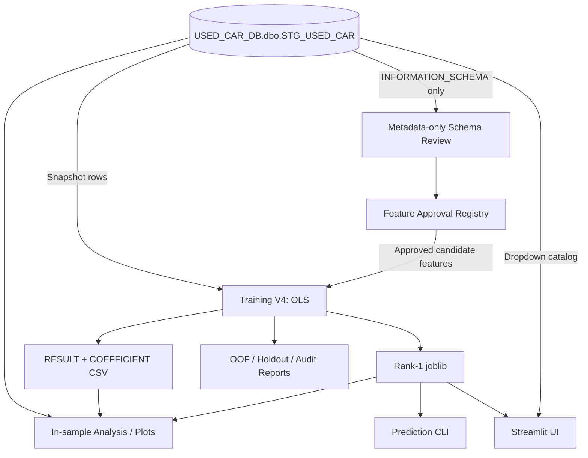

# USECAR_PREDICT_PRICE

คู่มือหลักภาษาไทยสำหรับระบบ OLS Used Car Price Prediction ตั้งแต่ตรวจ Schema, ควบคุม Feature, Train, อ่านผล ไปจนถึง Predict ผ่าน CLI และ Streamlit

> สถานะปัจจุบัน: Feature Registry ได้รับ Owner Approval สำหรับให้ 11 predictors เข้าสู่ Candidate Universe แล้ว แต่การอนุมัตินี้ไม่ได้บังคับให้โมเดลเลือกครบทุก feature และไม่ได้แทนการอนุมัติ Controlled Training แต่ละครั้ง

## สารบัญ

- [1. Project Overview](#project-overview)
- [2. Quick Start](#quick-start)
- [3. Project Structure](#project-structure)
- [4. คู่มือ Python ทุกไฟล์](#python-files)
- [5. Shell Scripts และ Runners](#shell-scripts)
- [6. Feature Approval และ Dynamic Schema](#feature-approval)
- [7. Training V4 Explained](#training-v4)
- [8. Training Output และ Artifact Dictionary](#artifacts)
- [9. Prediction Guide](#prediction-guide)
- [10. Model Evaluation และข้อจำกัด](#evaluation-limitations)
- [11. Operation Runbook](#operation-runbook)
- [12. Troubleshooting / FAQ](#troubleshooting)
- [13. Documentation Index และการดูแลเอกสาร](#documentation-index)

<a id="project-overview"></a>
## 1. Project Overview

โปรเจกต์นี้สร้างโมเดล **Ordinary Least Squares (OLS)** เพื่อประมาณ `price` ของประกาศรถมือสองจาก latest snapshot ใน `USED_CAR_DB.dbo.STG_USED_CAR` ค่าเป้าหมายคือราคาที่อยู่ใน source snapshot ไม่ใช่ราคาขายจริงในอนาคตที่ระบบรับประกัน

Training V4 ใช้เฉพาะแถวที่ `price > 1,000` บาทในการ Train/Evaluation เพราะเป็นกลุ่มที่กำหนดว่ามีราคาสำหรับเรียนรู้ เงื่อนไขนี้ใช้กับข้อมูลที่ทราบ target เท่านั้น ไม่ใช้ตรวจรถใหม่ก่อน Predict

เทคโนโลยีที่พบจาก source จริง:

- Python, pandas, NumPy
- statsmodels OLS
- scikit-learn สำหรับ metrics และ stratified/group-aware folds
- SQLAlchemy + pyodbc สำหรับ SQL Server
- joblib สำหรับ Model Bundle
- Streamlit สำหรับ UI
- matplotlib สำหรับกราฟ diagnostics
- Bash สำหรับ schema-review และ training runners

โปรเจกต์ยังไม่มี `requirements.txt`, `pyproject.toml` หรือ dependency lockfile จึงยังไม่มีคำสั่งสร้าง environment ใหม่ที่รับประกัน reproducibility



Training Workflow อ่าน DB, ตรวจ Registry/Schema, สร้าง Development/Holdout และ CV, fit OLS แล้วเขียน artifacts ส่วน Prediction Workflow โหลด Rank-1 `.joblib` ที่มี frozen feature schema/preprocessor และไม่ retrain

<a id="quick-start"></a>
## 2. Quick Start

### 2.1 เปิดโปรเจกต์บน Mac / VS Code Terminal

```bash
cd /Users/krissanap/Document/KMUTT/USECAR_PREDICT_PRICE
source .venv/bin/activate
python --version
```

`.venv` มีอยู่ใน Workspace แต่ถูก Git ignore หากต้องสร้างใหม่ ต้องจัดทำ dependency manifest และตรวจเวอร์ชันก่อน ปัจจุบันไม่ควรเดาคำสั่งติดตั้ง dependencies จาก README นี้

### 2.2 Environment Variables

ค่าที่เกี่ยวข้องกับฐานข้อมูล:

| Variable | ค่า default ในโค้ด / หน้าที่ |
| --- | --- |
| `USED_CAR_DB_SERVER` | `127.0.0.1` |
| `USED_CAR_DB_PORT` | `1433` |
| `USED_CAR_DB_DATABASE` | `USED_CAR_DB` |
| `USED_CAR_DB_USER` | `sa` |
| `USED_CAR_DB_PASSWORD` | ไม่มี default ที่ใช้งานได้ ต้องกำหนด |
| `USED_CAR_DB_DRIVER` | `ODBC Driver 18 for SQL Server` |
| `USED_CAR_DB_SCHEMA` | `dbo` |
| `USED_CAR_SOURCE_TABLE` | `STG_USED_CAR` |

อย่าใส่ Password ลงไฟล์, README หรือ command line ใช้ hidden prompt เช่น:

```bash
IFS= read -r -s -p "SQL Server password: " USED_CAR_DB_PASSWORD; echo
export USED_CAR_DB_PASSWORD
# รันคำสั่งที่ได้รับอนุมัติ
unset USED_CAR_DB_PASSWORD
```

ข้อความใน shell history จะมีเพียงชื่อตัวแปร ไม่มีค่ารหัสผ่าน

### 2.3 คำสั่งหลัก

| งาน | คำสั่ง | ต้องใช้ SQL Server |
| --- | --- | --- |
| ตรวจ Actual Schema | `./scripts/run_schema_review.sh` | ใช่; metadata only |
| เทียบ Schema Report กับ Registry | ดูคำสั่งด้านล่าง | ไม่ใช้ |
| Train Model | `./scripts/run_training_v4.sh` | ใช่; เป็น Training จริง ต้องได้รับอนุมัติ |
| รัน tests | `PYTHONDONTWRITEBYTECODE=1 .venv/bin/python -m unittest discover -s tests -v` | ไม่ใช้ |
| ดู feature ของ saved model | `.venv/bin/python predict_used_car_ols.py --run-id <RUN_ID> --show-features` | ไม่ใช้ |
| Predict รถหนึ่งคัน | ดู [Prediction Guide](#prediction-guide) | ไม่ใช้ |
| Predict CSV | `.venv/bin/python predict_used_car_ols.py --run-id <RUN_ID> --input-csv <INPUT.csv> --output-csv <OUTPUT.csv>` | ไม่ใช้ |
| เปิด Streamlit | `.venv/bin/python -m streamlit run app_used_car.py` | ใช้ DB สำหรับ dropdown catalog เมื่อโมเดลใช้ brand/model/sub_model |
| สร้าง analysis CSV | `.venv/bin/python analyze_used_car_ols.py` | ใช่ |
| สร้างกราฟ | `.venv/bin/python plot_used_car_ols.py` | ใช่ |

ตรวจ Schema แบบปลอดภัย:

```bash
./scripts/run_schema_review.sh
```

จากนั้นเทียบ report ที่สร้างกับ Registry โดยไม่เชื่อม DB:

```bash
PYTHONDONTWRITEBYTECODE=1 .venv/bin/python scripts/validate_schema_registry.py \
  output/analysis/schema_review/actual_schema_<TIMESTAMP>.json
```

Train จริงหลังได้รับอนุมัติและตั้ง environment แล้ว:

```bash
./scripts/run_training_v4.sh
```

ตรวจผล Training หลักจาก `output/train/<PCS_DATE>/` และ V4 evaluation จาก `output/analysis/<PCS_DATE>/` ก่อนใช้โมเดล

<a id="project-structure"></a>
## 3. Project Structure

```text
USECAR_PREDICT_PRICE/
├── README.md
├── AGENTS.md
├── train_used_car_ols.py
├── predict_used_car_ols.py
├── app_used_car.py
├── analyze_used_car_ols.py
├── plot_used_car_ols.py
├── config/
│   └── feature_approval_registry.json
├── scripts/
│   ├── review_stg_schema.py
│   ├── validate_schema_registry.py
│   ├── run_schema_review.sh
│   └── run_training_v4.sh
├── tests/
│   └── test_training_evaluation_v4.py
├── Docs/
│   ├── PROJECT_CONTEXT.md
│   ├── WORK_LOG.md
│   ├── FEATURE_APPROVAL_REGISTRY.md
│   ├── Used_Car_OLS_Data_Dictionary_Thai_Clear.xlsx
│   └── Used_Car_OLS_End_to_End_Spec_v4_1.html
├── output/
│   ├── train/<PCS_DATE>/
│   ├── analysis/<PCS_DATE>/
│   ├── predict/<PCS_DATE>/
│   └── graphs/<PCS_DATE>/
├── logs/
└── ONE2CAR/
```

- **Source Code:** Python/Shell filesที่ root และ `scripts/`
- **Config:** Registry ที่ควบคุมสิทธิ feature ก่อน statistical eligibility
- **Model Artifacts:** CSV/joblib ใต้ `output/train/`
- **Reports:** evaluation, schema, analysis และกราฟใต้ `output/analysis/`/`output/graphs/`
- **Raw Data:** `ONE2CAR/` ไม่ใช่ input ของ training script ปัจจุบันและไม่ควร Commit/เผยแพร่โดยไม่ตรวจ
- **Logs:** terminal output จาก training runner; `.gitignore` ป้องกัน log ใหม่โดย default

`RUN_ID` คือเวลารันรูป `YYYYMMDD_HHMMSS` ส่วนชื่อ directory `<PCS_DATE>` มาจาก snapshot date ในข้อมูล ทั้งสองค่าอาจเป็นคนละวัน

<a id="python-files"></a>
## 4. คู่มือ Python ทุกไฟล์

Workspace มี Python 8 ไฟล์: Application 5, schema tools 2 และ test module 1

### 4.1 [`train_used_car_ols.py`](train_used_car_ols.py)

- **ใช้เมื่อ:** ได้รับอนุมัติให้ Train OLS ใหม่
- **Input:** `SELECT *` จาก configured source table, Feature Registry, DB environment
- **Prerequisites:** SQL Server/ODBC, Password environment, Registry approved, snapshot มี `price` และ `PCS_DATE`
- **Command:** ควรเรียกผ่าน `./scripts/run_training_v4.sh`; รันไฟล์ตรงได้แต่จะไม่มี runner checks/log orchestration
- **Arguments:** ไม่มี argparse; `USED_CAR_RUN_ID` optional และต้องเป็น `YYYYMMDD_HHMMSS`
- **Process:** schema gate → price/outlier audit → eligible cohort → group-safe split/CV → OLS/backward elimination → ranking → Rank-1 holdout → frozen full-data refit → export
- **Output:** artifacts ทุกประเภทใน [Artifact Dictionary](#artifacts)
- **Side effects:** อ่าน snapshot ทั้งตารางและเขียนหลายไฟล์ ไม่ทำ DDL/DML
- **Common errors:** Password หาย, Registry ไม่ approved, Schema drift, PCS_DATE หลายค่า, RUN_ID ชนไฟล์เดิม, candidate ไม่เพียงพอ
- **ความสัมพันธ์:** สร้าง joblib/CSV ให้ predictor, UI, analyze และ plot

### 4.2 [`predict_used_car_ols.py`](predict_used_car_ols.py)

- **ใช้เมื่อ:** Predict ด้วย Rank-1 saved model โดยไม่ต่อ DB
- **Input:** trusted `used_car_models_<RUN_ID>.joblib` และ direct/JSON/CSV input
- **Prerequisites:** matching `train_used_car_ols.py`, dependencies และ model bundle
- **Commands:** ดู [Prediction Guide](#prediction-guide)
- **Arguments:** `--run-id`, `--car-json`, `--input-csv`, `--write-template`, `--show-features`, `--output-csv`, `--feature NAME=VALUE`; dynamic `NAME=VALUE` หรือ `--NAME VALUE` ก็รองรับ
- **Process:** ตรวจ bundle/run/folder → restore frozen preprocessor → validate required inputs → encode → OLS predict → diagnostics
- **Output:** `output/predict/<PCS_DATE>/used_car_predictions_<RUN_ID>.csv` หรือ path จาก `--output-csv`; template ชื่อ `cars_to_predict_template_<RUN_ID>.csv`
- **Side effects:** อ่าน trusted joblib และเขียน CSV เท่านั้น Default prediction filenameของ runเดิมอาจถูกเขียนทับ จึงควรใช้ `--output-csv` สำหรับหลายชุด
- **Common errors:** model ไม่พบ, RUN_ID/folder mismatch, missing inputs, duplicated column names, unexpected direct feature, encoded schema ไม่ตรง coefficients

### 4.3 [`app_used_car.py`](app_used_car.py)

- **ใช้เมื่อ:** ต้องการ UI ทำนายรถทีละคัน
- **Input:** saved joblib และ in-memory dropdown catalog จาก STG
- **Prerequisites:** model อย่างน้อยหนึ่งไฟล์; SQL connection เมื่อโมเดลต้องใช้ cascade fields
- **Command:** `.venv/bin/python -m streamlit run app_used_car.py`
- **Arguments:** ไม่มี application argparse; ใช้ Streamlit CLI
- **Process:** เลือก model → load frozen schema → query `TOP (0)` และ `SELECT DISTINCT PCS_DATE, brand, model, sub_model` → render form → shared predictor
- **Output:** แสดงราคา/negative warning/category mapping และ CSV downloadใน browser
- **Side effects:** อ่าน DB และ model; catalog cacheใน memory; ไม่เขียน catalog CSVและไม่ retrain
- **Common errors:** model ไม่พบ, catalog columns หาย, DB connection, snapshot dropdownต่างจาก model, numeric inputไม่ถูกต้อง

### 4.4 [`analyze_used_car_ols.py`](analyze_used_car_ols.py)

- **ใช้เมื่อ:** ต้องการ in-sample error diagnostics ของ complete run
- **Input:** RESULT, COEFFICIENT, Rank-1 joblib และ matching current STG snapshot
- **Prerequisites:** DB connectionและ artifactsสามไฟล์ตรงกัน
- **Command:** `.venv/bin/python analyze_used_car_ols.py`
- **Arguments:** ไม่มี argparse; `RUN_ID` เป็นค่าคงที่ใน source ปัจจุบัน (`20260920_011528`) หรือแก้เป็น `None` เพื่อเลือก latest complete run
- **Process:** load artifacts → อ่าน STG → บังคับ PCS_DATE ตรง model → predict in-sample → แยก price band, errors, negative และ OTHER
- **Output:** `00_overview_…` ถึง `06_all_in_sample_predictions_…` ใต้ `output/analysis/<PCS_DATE>/`
- **Side effects:** อ่าน DB/joblib และเขียน row-level CSV; ไม่ retrain
- **ข้อควรระวัง:** เป็น in-sample diagnostics และ `clean_target()` เก็บ positive pricesทั้งหมด จึงไม่ใช่ V4 OOF/Holdout report และอาจไม่ตรง eligible cohort `price > 1,000`

### 4.5 [`plot_used_car_ols.py`](plot_used_car_ols.py)

- **ใช้เมื่อ:** สร้างกราฟของ complete run
- **Input:** artifactsสามไฟล์และ matching STG snapshot
- **Prerequisites:** DB/model/CSV; `RUN_ID=None` เลือก latest complete run
- **Command:** `.venv/bin/python plot_used_car_ols.py`
- **Arguments:** ไม่มี argparse; เลือก runโดยแก้ค่าคงที่ `RUN_ID`
- **Process:** validate artifacts → in-sample prediction → สร้าง actual/predicted, residual, model comparison, distribution และ coefficient CI
- **Output:** PNG 5 ไฟล์ใต้ `output/graphs/<PCS_DATE>/`
- **Side effects:** อ่าน DB/joblib/CSV และเขียน PNG; ชื่อเดิมถูกเขียนทับได้
- **ข้อควรระวัง:** กราฟสามชนิดเป็น in-sample ข้อความบางจุดใน scriptยังเรียก CSV metric ว่า mean 5-fold แต่ Training V4 export `RMSE/MAE` เป็น pooled Development OOF ให้ยึด V4 metadata เป็นหลัก

### 4.6 [`scripts/review_stg_schema.py`](scripts/review_stg_schema.py)

- **ใช้เมื่อ:** ต้องการ Actual Schema metadata โดยไม่อ่านข้อมูลรถ
- **Input:** DB environment; queryเฉพาะ `INFORMATION_SCHEMA.COLUMNS`
- **Prerequisites:** SQL connection; ควรเรียกผ่าน shell wrapper
- **Command:** `./scripts/run_schema_review.sh`
- **Arguments:** `--output <PATH>` optional
- **Process:** static read-only SQL guard → metadata query → fingerprint
- **Output:** `output/analysis/schema_review/actual_schema_<TIMESTAMP>.json`
- **Side effects:** อ่าน metadataและเขียน JSON; refuse overwrite; ไม่มี table-row SELECT/DDL/DML

### 4.7 [`scripts/validate_schema_registry.py`](scripts/validate_schema_registry.py)

- **ใช้เมื่อ:** เทียบ local schema report กับ Registry โดย offline
- **Input:** report JSON และ Registry JSON
- **Prerequisites:** reportจาก schema reviewer
- **Command:** `PYTHONDONTWRITEBYTECODE=1 .venv/bin/python scripts/validate_schema_registry.py <REPORT>`
- **Arguments:** positional `report`, optional `--registry <PATH>`
- **Process:** ตรวจ scope/count/fingerprint/ordinal → map SQL type family → New/Missing/type compatibility/authorization
- **Output:** JSON summaryบน terminal; exit `0` เมื่อ valid, `1` เมื่อพบ issues
- **Side effects:** อ่าน local JSON เท่านั้น ไม่เขียนไฟล์และไม่เชื่อม DB

### 4.8 [`tests/test_training_evaluation_v4.py`](tests/test_training_evaluation_v4.py)

- **ใช้เมื่อ:** หลังแก้ Training V4, Registry Gate, output contracts หรือก่อนเสนอ Commit
- **Command:** `PYTHONDONTWRITEBYTECODE=1 .venv/bin/python -m unittest discover -s tests -v`
- **Process:** synthetic testsสำหรับ cohort, leakage-safe split/CV, preprocessing, ranking, holdout/refit, bundle, schema drift, Registry และ offline validator
- **Output:** test resultบน terminal ไม่มี training artifacts
- **Side effects:** ใช้ temporary directories; ไม่ต่อ DBและไม่ใช้ข้อมูลรถจริง
- **สถานะล่าสุดใน Work Log:** 36 testsผ่าน ณ Initial Owner Approval validation

<a id="shell-scripts"></a>
## 5. Shell Scripts และ Runners

### [`scripts/run_schema_review.sh`](scripts/run_schema_review.sh)

Wrapper นี้ปิด shell tracing, ถาม Passwordด้วย hidden prompt, exportให้ child process แล้วเรียก `review_stg_schema.py` หน้าที่ของมันคือ Schema Metadata Review ไม่ใช่ Training

```bash
./scripts/run_schema_review.sh
```

### [`scripts/run_training_v4.sh`](scripts/run_training_v4.sh)

Runner นี้เริ่ม **Training จริง** สร้าง RUN_ID, ใช้ `tee` ให้เห็น outputพร้อมเขียน `logs/train_<RUN_ID>.log`, รักษา Python exit statusด้วย `pipefail`, scan logหา credential pattern และตรวจ RESULT/COEFFICIENT/joblibว่ามี exactly oneชุดสำหรับ RUN_ID

Runner ไม่ถาม Password ต้องกำหนด environmentก่อน และจะ refuse overwrite logเดิม:

```bash
IFS= read -r -s -p "SQL Server password: " USED_CAR_DB_PASSWORD; echo
export USED_CAR_DB_PASSWORD
./scripts/run_training_v4.sh
unset USED_CAR_DB_PASSWORD
```

อย่ารันเพื่อตรวจ Schemaหรือ dry run และต้องได้รับ Owner Approval สำหรับ Controlled Training ก่อน

<a id="feature-approval"></a>
## 6. Feature Approval และ Dynamic Schema

ต้นทางคือ `USED_CAR_DB.dbo.STG_USED_CAR` ทุก Training Run ตรวจ schemaจริงกับ [`config/feature_approval_registry.json`](config/feature_approval_registry.json)

| Status | ความหมาย |
| --- | --- |
| `APPROVED` | มีสิทธิเข้า Candidate Universeหากมีอยู่และ type compatible |
| `PENDING_REVIEW` | ตรวจพบ/รู้จักแต่ห้ามเข้าสู่ trainingจน Ownerอนุมัติ |
| `EXCLUDED` | ห้ามเป็น predictor เช่น identifier, raw/technical, leakage risk |
| `TARGET` | `price`; ใช้เป็น y เท่านั้น |
| `MANDATORY_METADATA` | `PCS_DATE`; จำเป็นต่อ snapshot contractแต่ไม่ใช่ predictor |

Approved 11: `brand`, `model`, `sub_model`, `model_year`, `mileage`, `fuel_type`, `transmission`, `engine_size`, `body_type`, `color`, `number_of_seats`

Pending 4: `province`, `location`, `seller_name`, `seller_type`

เมื่อ Alice เพิ่ม/ลบ/เปลี่ยนคอลัมน์:

1. รัน metadata-only schema review
2. validate reportกับ Registry
3. New/renamed featureเป็น Pending ไม่อนุมัติอัตโนมัติ
4. Missing/unsupported Approved featureถูกรายงานและไม่อนุญาตให้ใช้
5. Owner review prediction availability/leakage/type แล้วแก้ Registryแบบตรวจย้อนหลังได้
6. statistical eligibilityยังเรียนจาก fold trainหลัง approval gate

Owner Approval เป็น permission layer ส่วน p-value/eligibility เป็น statistical layer ดังนั้น Approved 11 ไม่ได้แปลว่าโมเดลทุก runใช้ครบ 11 ดูรายละเอียดที่ [`Docs/FEATURE_APPROVAL_REGISTRY.md`](Docs/FEATURE_APPROVAL_REGISTRY.md)

<a id="training-v4"></a>
## 7. Training V4 Explained

1. **Snapshot:** อ่าน STG และกำหนด single `PCS_DATE`; folderผลลัพธ์ใช้วันที่นี้
2. **Schema Gate:** ตรวจ Registry checksum/status/type ก่อน candidate generation
3. **Target Cleaning:** แปลง `price`, ตัด missing/non-finite/non-positive
4. **Eligible Cohort:** ใช้ `price > 1,000` สำหรับ Development/CV/Holdout/refit
5. **Outlier Review:** price-quality/group-based outliersเป็น Flag-only ไม่ลบอัตโนมัติ
6. **Duplicate Groups:** เชื่อม `listing_id`/`source_url` แบบ transitiveก่อนตัด cohort ป้องกัน identityข้าม partition
7. **Development/Holdout:** group-safe splitใกล้ 80/20 ภายใน toleranceที่กำหนด
8. **Common 5-Fold CV:** ทุก candidateใช้ foldsชุดเดียวกัน
9. **Fold-local Learning:** type conversion, median, missing/cardinality, category levels/reference/`__OTHER__`, eligibility และ feature selectionเรียนจาก fold-trainเท่านั้น
10. **OLS + Backward Elimination:** ลบ source feature groupตาม p-value threshold ไม่ใช่ลบ dummyแต่ละตัวอิสระ Categorical sourceหนึ่งตัวมีหลาย dummy; `SOURCE_FEATURE_P_VALUE` จึงต่างจาก `P_VALUE` ของ dummyแต่ละแถว
11. **Candidates:** เปรียบเทียบ source-feature combinations และ BASELINE/EXPANDED brand-model encoding profiles
12. **Ranking:** pooled Development OOF RMSE → pooled OOF MAE → Candidate ID; เลือกสูงสุด `TOP_N_MODELS=3`
13. **Holdout:** ประเมิน Rank-1 Development checkpointหนึ่งครั้ง ไม่ใช้ Holdoutเลือก candidate
14. **Full-data Refit:** freeze preprocessor/selected structureจาก Development แล้ว fitเฉพาะ OLS coefficientsบน eligible full data
15. **Export:** Top modelsใน CSV และ Rank-1 full-data refitใน joblib

Development OOF metricsใช้เลือกโมเดล Holdout metricsใช้ประเมิน Rank-1 checkpoint ส่วน R²/Adjusted R² และ coefficient statisticsมาจาก full-data refit Holdout reportจึงไม่ได้เป็น independent testของ exported full-data-refit `.joblib` โดยตรง

<a id="artifacts"></a>
## 8. Training Output และ Artifact Dictionary

| Artifact | ผู้สร้าง / ตำแหน่ง | ใช้ทำอะไร / ขั้นต่อไป |
| --- | --- | --- |
| `OLS_REGRESSION_RESULT_<RUN_ID>.csv` | Training; `output/train/<PCS_DATE>/` | Top models, OOF RMSE/MAE และ full-refit fit statistics; ใช้ review/plot |
| `OLS_REGRESSION_COEFFICIENT_<RUN_ID>.csv` | Training; folderเดียวกัน | coefficients, dummy/reference, p-values, CI; ใช้ review/plot |
| `used_car_models_<RUN_ID>.joblib` | Training; folderเดียวกัน | Rank-1 OLS + frozen schema/preprocessor; ใช้ Predict/UI/diagnostics โหลดเฉพาะไฟล์ที่เชื่อถือได้ |
| `training_evaluation_<RUN_ID>.csv` | Training; `output/analysis/<PCS_DATE>/` | Development OOF candidate/price-band และ Holdout summary |
| `training_evaluation_metadata_<RUN_ID>.json` | Training | split/fold/checksum, Registry provenance, stage semantics |
| `holdout_predictions_<RUN_ID>.csv` | Training | row-level Rank-1 checkpoint Holdout predictions; sensitive ไม่ต้องใช้ตอน Predict |
| `train_row_selection_<RUN_ID>.csv` | Training | eligible/exclusion/split audit |
| `schema_review_<RUN_ID>.json` | Training gate | runtime schema/Registry comparison |
| `price_quality_all_<RUN_ID>.csv` | Training | price-quality flagsทุกแถว |
| `price_outliers_for_review_<RUN_ID>.csv` | Training | subsetสำหรับ human review; flagsไม่ลบ trainอัตโนมัติ |
| `logs/train_<RUN_ID>.log` | Training shell runner | terminal audit; inspect secretsก่อนแชร์ |
| `actual_schema_<TIMESTAMP>.json` | Metadata reviewer; `output/analysis/schema_review/` | column metadata/fingerprintสำหรับ Registry review |
| `used_car_predictions_<RUN_ID>.csv` | Prediction CLI; `output/predict/<PCS_DATE>/` | ผล point prediction |
| `00_…`–`06_…<RUN_ID>.csv` | Analyze script | in-sample diagnostics ไม่ใช่ V4 Holdout |
| `01_…`–`05_…<RUN_ID>.png` | Plot script; `output/graphs/<PCS_DATE>/` | visualizationของ in-sample/CSV/coefficient information |

เปิด CSVด้วย Excel/pandasได้ JSONด้วย text editorหรือ `python -m json.tool` และ PNGด้วย image viewer ห้ามเปิด untrusted joblib เพราะ deserializationสามารถรันโค้ดได้

ไฟล์ที่ `analyze_used_car_ols.py` เขียนจริงมี `00_overview_<RUN_ID>.csv`, `01_error_by_price_band_<RUN_ID>.csv`, `02_top_100_errors_<RUN_ID>.csv`, `03_negative_predictions_<RUN_ID>.csv`, `04_any_other_vs_retained_<RUN_ID>.csv`, `05_other_by_feature_<RUN_ID>.csv` และ `06_all_in_sample_predictions_<RUN_ID>.csv` ไฟล์ `02`, `03`, `06` มีข้อมูลระดับ listing จึงต้องควบคุมการเผยแพร่

ไฟล์ที่ `plot_used_car_ols.py` เขียนจริงมี `01_actual_vs_predicted_<RUN_ID>.png`, `02_residual_plot_<RUN_ID>.png`, `03_model_comparison_<RUN_ID>.png`, `04_price_distribution_<RUN_ID>.png` และ `05_coefficient_confidence_interval_<RUN_ID>.png`

### RESULT CSV — 18 columns

`MODEL_ID`, `MODEL_NAME`, `TARGET_NAME`, `TRAIN_PCS_DATE`, `TRAIN_DATE`, `N_OBSERVATION`, `R_SQUARED`, `ADJ_R_SQUARED`, `MAE`, `RMSE`, `F_STATISTIC`, `F_P_VALUE`, `P_VALUE_THRESHOLD`, `CONFIDENCE_LEVEL`, `ACTIVE_FLAG`, `APPROVED_BY`, `APPROVED_DATE`, `PCS_DATE`

- `MAE`/`RMSE` ใน V4 คือ pooled Development OOF metrics
- `N_OBSERVATION` และ fit statisticsอ้าง full-data refitของ modelนั้น
- Approval fieldsไม่ได้หมายความว่า modelถูก deployโดยอัตโนมัติ ดูนิยามทางการใน Data Dictionary

### COEFFICIENT CSV — 13 columns

`MODEL_ID`, `FEATURE_SEQ`, `SOURCE_COLUMN`, `ORIGINAL_VALUE`, `FEATURE_NAME`, `FEATURE_TYPE`, `COEFFICIENT`, `P_VALUE`, `SOURCE_FEATURE_P_VALUE`, `CI_LOWER`, `CI_UPPER`, `IS_REFERENCE`, `PCS_DATE`

`P_VALUE` เป็นระดับ encoded coefficient/dummy ขณะที่ `SOURCE_FEATURE_P_VALUE` ประเมิน source feature group สำหรับ categorical feature `IS_REFERENCE=Y` ระบุ reference category ดู null rulesและนิยามเต็มใน [`Docs/Used_Car_OLS_Data_Dictionary_Thai_Clear.xlsx`](Docs/Used_Car_OLS_Data_Dictionary_Thai_Clear.xlsx)

<a id="prediction-guide"></a>
## 9. Prediction Guide

### เลือก Model และดู Input Contract

ไม่ส่ง `--run-id` จะเลือก runที่ชื่อใหม่สุด การระบุ RUN_IDชัดเจนปลอดภัยกว่า:

```bash
.venv/bin/python predict_used_car_ols.py --run-id <RUN_ID> --show-features
```

สร้าง template:

```bash
.venv/bin/python predict_used_car_ols.py --run-id <RUN_ID> \
  --write-template --output-csv input/cars_<RUN_ID>.csv
```

### รถหนึ่งคัน

ตัวอย่าง Toyota CAMRY ต่อไปนี้เป็นข้อมูลสมมติ ไม่รับประกันราคาตลาด ต้องส่งเฉพาะ featureที่ `--show-features` ระบุ:

```bash
.venv/bin/python predict_used_car_ols.py --run-id <RUN_ID> \
  --feature brand=Toyota \
  --feature model=CAMRY \
  --feature model_year=2020 \
  --feature mileage=60000 \
  --output-csv output/predict/manual/toyota_camry.csv
```

หาก saved modelต้องใช้ featureอื่น ต้องเพิ่มให้ครบ หาก modelไม่ได้ใช้ featureใด ห้ามส่ง featureนั้นใน direct mode

JSON mode:

```bash
.venv/bin/python predict_used_car_ols.py --run-id <RUN_ID> \
  --car-json '{"brand":"Toyota","model":"CAMRY","model_year":2020,"mileage":60000}' \
  --output-csv output/predict/manual/toyota_camry_json.csv
```

### หลายคันจาก CSV

```bash
.venv/bin/python predict_used_car_ols.py --run-id <RUN_ID> \
  --input-csv input/cars_<RUN_ID>.csv \
  --output-csv output/predict/manual/batch_<RUN_ID>.csv
```

### Category Encoding และผลลัพธ์

- Input column namesจับคู่แบบ case-insensitive แต่ category valuesถูกเทียบกับ saved levelsแบบ case-sensitive
- `Camry` และ `CAMRY` อาจไม่ใช่ levelเดียวกัน
- unseen/rare categoryถูก mapเป็น `__OTHER__`; missing text normalizeเป็น `__MISSING__` ก่อน mapping
- numeric missing/แปลงไม่ได้ใช้ training medianตาม saved preprocessor
- ส่งเฉพาะ schemaของ saved model ไม่ใช่ Approved 11ทั้งหมด
- `PREDICTED_PRICE_THB`: OLS point prediction
- `NEGATIVE_PREDICTION`: `True` เมื่อผลต่ำกว่า 0; ระบบไม่ clamp
- `<feature>_MODEL_CATEGORY`: categoryจริงที่ encoderใช้ ช่วยตรวจ `__OTHER__`

เปิด UI:

```bash
.venv/bin/python -m streamlit run app_used_car.py
```

<a id="evaluation-limitations"></a>
## 10. Model Evaluation และข้อจำกัด

- **MAE:** ค่าเฉลี่ย absolute error อ่านง่ายเป็นบาทและไวต่อ extreme errorน้อยกว่า RMSE
- **RMSE:** ให้น้ำหนัก errorขนาดใหญ่มากกว่า ใช้เป็น rankingหลักใน V4
- **R²:** สัดส่วน variationที่ OLS full-data fitอธิบายได้ ไม่ใช่ errorเป็นบาทและไม่รับประกัน generalization
- **Adjusted R²:** ปรับจำนวน predictors แต่ยังเป็น fit statistic ไม่ใช่ Holdout score
- **p-value:** หลักฐานเชิงสถิติภายใต้สมมติฐาน OLS ไม่ใช่ขนาดผลกระทบหรือ business importance

ข้อจำกัดที่ต้องพิจารณา:

- OLS ให้ค่าติดลบได้และระบบรายงานตามจริง
- Outlier flagsเป็น review-only; extreme pricesยังกระทบ OLSได้
- `__OTHER__` รวมหลาย category ทำให้ความละเอียดลดลง
- กลุ่มข้อมูลน้อยอาจมี errorสูงและ coefficientไม่เสถียร
- Snapshot/schema/category driftทำให้ข้อมูลใหม่ต่างจาก training
- Holdoutวัด Development checkpoint ไม่ใช่ exported full-data refitโดยตรง
- Predictionเป็นค่าประมาณจากประกาศ snapshot ไม่ใช่ราคาขายที่รับประกันหรือ prediction interval

เมื่อราคาแปลก ให้ตรวจ RUN_ID/PCS_DATE, required inputs, numeric units, `*_MODEL_CATEGORY`, negative flag, OOF/Holdout price band, row-selection/outlier reports และ schema driftก่อนตัดสินใจแก้หรือ retrain

<a id="operation-runbook"></a>
## 11. Operation Runbook

| เหตุการณ์ | การดำเนินการ | ความถี่ |
| --- | --- | --- |
| รับ Snapshot ใหม่จาก Alice | ตรวจ `PCS_DATE`/Schema metadata แล้ว validate Registry | ต้องทำต่อ snapshotที่จะ Train |
| Schema เปลี่ยน | `run_schema_review.sh` → offline validator → Owner review | ต้องทำเมื่อเปลี่ยน |
| Ownerอนุมัติ Featureใหม่ | แก้ Registry/version/evidence, tests, docs; ยังไม่ Trainอัตโนมัติ | เมื่อจำเป็น |
| จะ Trainใหม่ | ตรวจ approval, environment, RUN_ID แล้วใช้ `run_training_v4.sh` | ต้องได้รับอนุมัติแต่ละรอบ |
| หลัง Trainสำเร็จ | ตรวจ log, artifacts, counts, candidate ranking, OOF/Holdout, negative/OTHER, schema checksum | ต้องทำทุก run |
| Predictหนึ่งคัน | `--show-features` แล้ว direct/JSON หรือ UI | ตามใช้งาน |
| Predict batch | สร้าง template → เติม → `--input-csv` และกำหนด outputใหม่ | ตามใช้งาน |
| วิเคราะห์ model | ใช้ V4 sidecarsก่อน; analyze/plotเมื่ออยากดู in-sample diagnostics | รันเมื่อจำเป็น |
| พบ Error | หยุด, เก็บ RUN_ID/errorแบบไม่เปิด secret, ตรวจ FAQ/WORK_LOG | เมื่อเกิด |

Testsไม่ต้องรันทุกครั้งที่ Predict แต่ควรรันหลังแก้ code/config/contractsและก่อนเสนอ Commit

<a id="troubleshooting"></a>
## 12. Troubleshooting / FAQ

### Terminal ไม่มี `USED_CAR_DB_PASSWORD`

ใช้ hidden promptใน [Quick Start](#quick-start) หรือ `run_schema_review.sh` อย่าส่ง Passwordผ่าน chat/README

### SQL Server connection error

ตรวจ server/port/database/user/ODBC Driver, SQL Server availability และว่า environmentอยู่ใน processเดียวกับคำสั่ง Errorจาก schema reviewerถูก sanitizeโดยตั้งใจ

### Registry ไม่ Approved หรือพบ Pending/New Feature

Training Gateจะหยุด สร้าง/ตรวจ schema report แล้วขอ Owner review ห้ามเพิ่ม Approvedอัตโนมัติ

### หา `.joblib` ไม่พบ

ตรวจ `output/train/<PCS_DATE>/used_car_models_<RUN_ID>.joblib`, `USED_CAR_ARTIFACT_DIR` และ RUN_ID

### RUN_ID หรือ path ไม่ตรง

RUN_IDในชื่อไฟล์และ bundleต้องตรง และ parent folderต้องตรง `pcs_date` รูป `YYYYMMDD` Training runnerใช้ IDเดียวกับ log/artifactsและ refuse collision

### `Missing model input columns`

รัน `--show-features` หรือ `--write-template` แล้วส่งทุก selected source featureของ bundle

### Category `Camry` กับ `CAMRY`

Column nameไม่สน case แต่ value matchingสน case ตรวจ retained levelsจาก `--show-features`

### Model mapเป็น `__OTHER__`

ค่าไม่อยู่ retained levelsหรือถูก frequency groupingตอน Train ตรวจ `<feature>_MODEL_CATEGORY`; อย่าแก้ spellingอัตโนมัติโดยไม่มีหลักฐาน

### Predicted priceติดลบ

OLSไม่ถูก clamp ตรวจ input/unit/category/runและใช้งานด้วยความระมัดระวัง `NEGATIVE_PREDICTION=True` เป็น diagnostic

### ต้องการ Holdout Report ของ runเดิม

ดู `training_evaluation_<RUN_ID>.csv`, `training_evaluation_metadata_<RUN_ID>.json` และ `holdout_predictions_<RUN_ID>.csv` ใน `output/analysis/<PCS_DATE>/` ไม่ใช้ `analyze_used_car_ols.py` แทน เพราะ scriptนั้นเป็น in-sample

<a id="documentation-index"></a>
## 13. Documentation Index และการดูแลเอกสาร

- [`README.md`](README.md): คู่มือใช้งานล่าสุด
- [`AGENTS.md`](AGENTS.md): กติกาการทำงานและขอบเขต
- [`Docs/PROJECT_CONTEXT.md`](Docs/PROJECT_CONTEXT.md): architecture/implementation context
- [`Docs/WORK_LOG.md`](Docs/WORK_LOG.md): ประวัติการเปลี่ยนแปลงและผลทดสอบ
- [`Docs/FEATURE_APPROVAL_REGISTRY.md`](Docs/FEATURE_APPROVAL_REGISTRY.md): หลักฐานและสถานะ Feature Approval
- [`Docs/Used_Car_OLS_Data_Dictionary_Thai_Clear.xlsx`](Docs/Used_Car_OLS_Data_Dictionary_Thai_Clear.xlsx): Data Dictionary ของ RESULT/COEFFICIENT
- [`Docs/Used_Car_OLS_End_to_End_Spec_v4_1.html`](Docs/Used_Car_OLS_End_to_End_Spec_v4_1.html): End-to-End Spec

หลังเปลี่ยน Python CLI, environment variables, Registry behavior, output names/contracts หรือ workflow ต้องอัปเดต READMEส่วนที่เกี่ยวข้องและบันทึกผลจริงใน WORK_LOG อย่าใส่ Password, token, raw dataset, row-level vehicle dataหรือ credentialed connection stringลงเอกสาร
